# 第一讲 逻辑与动机
#  1. 什么是深度无监督学习？

通过无标签的方式，利用深度网络捕捉到原始数据中的深度特征(区别于有监督学习)

1) 生成式模型：重构原始数据的分布

2) 自监督式学习：需要语义理解的“解谜”任务

# 2. 深度无监督学习的应用

1) 生成新的数据

2) 带输入条件的合成技术（例：WaveNet, GAN-pix2pix）

3) 压缩（所构建的生成模型越好，数据被压缩越好）

4) 无监督预训练，提升下游任务的算法性能（例：基于BERT的谷歌搜索）

5) 灵活的基础模块

6) 生成图片(Deep belief Nets, VAE, GAN,  DCGAN, 超分辨率SRGAN, 风格迁移CycleGAN, BigGAN, StyleGAN)

生成音频(WaveNet)

生成视频(DVD-GAN)

生成文本(Char-rnn, GPT2)

无损压缩(生成式模型比分布无关的压缩方法比特率更高，例：JPEG)

有损压缩(WaveOne)

下游任务(情感检测，NLP BERT革新，视觉性能对比)

    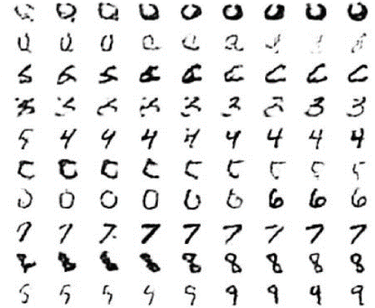
    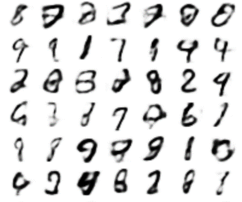

[Deep Belief Nets, Hinton, Osindero, Teh, 2006] & [ VAE, Kingma and Welling, 2013]

    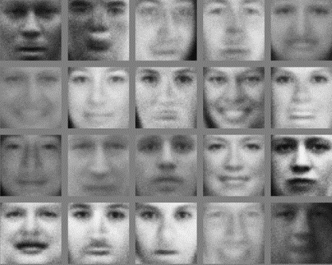
    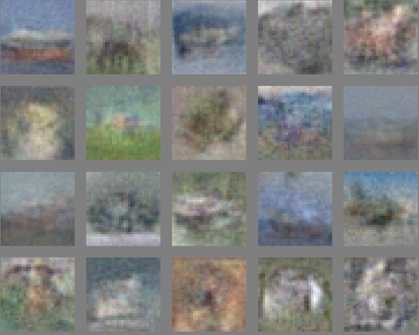 

[GAN, Goodfellow et al. 2014]

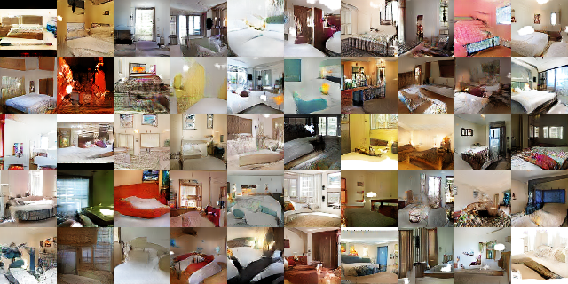

[DCGAN, Radford, Metz, Chintala 2015]

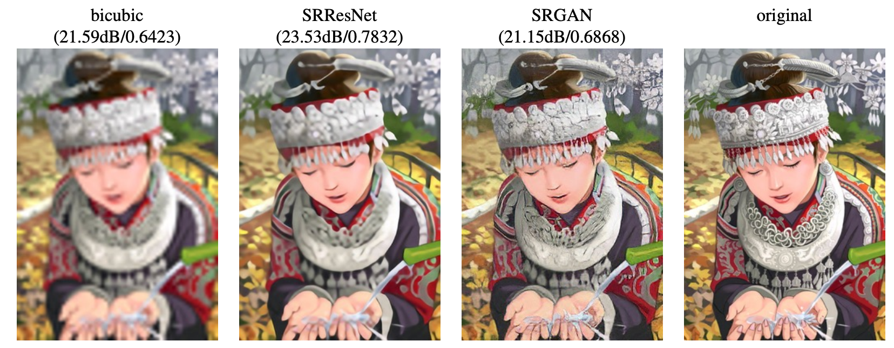

[Ledig, Theis, Huszar et al, 2017]

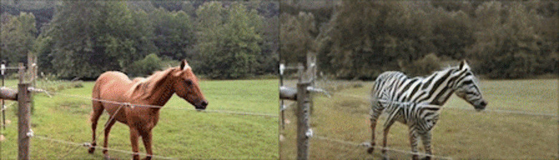

[CycleGAN: Zhu, Park, Isola & Efros, 2017]

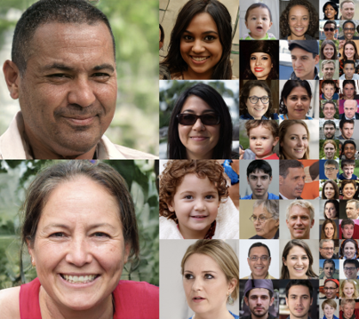

[StyleGAN, Karras, Laine, Aila, 2018]

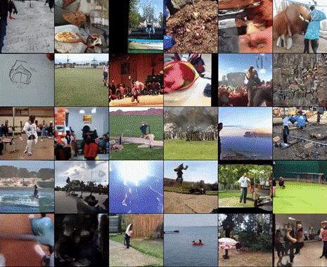

DVD-GAN: Adversarial Video Generation on Complex Datasets, Clark, Donahue, Simonyan, 2019

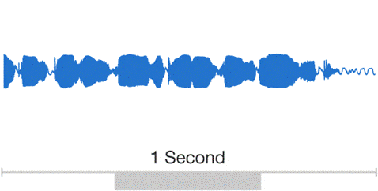

[WaveNet, Oord et al., 2018]

[OpenAI’s GPT2 -- Radford, Wu, Child, Luan, Amodei, Sutskever, 2019]

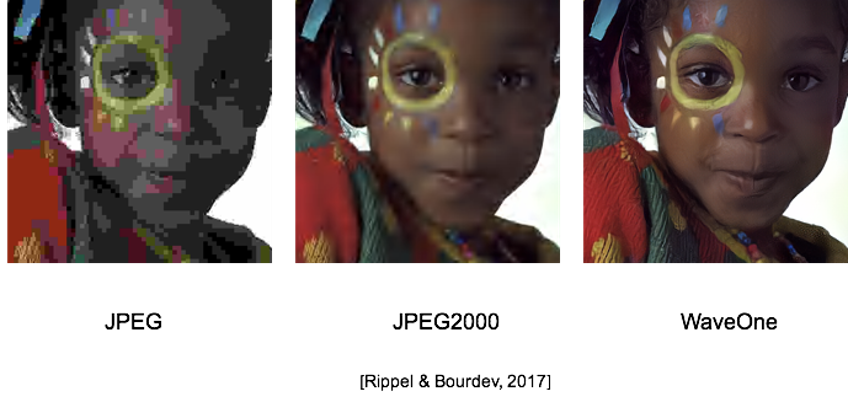

## 3 总结

1) 无监督学习：因算力的提升快速发展的领域；深度学习工程实践，数据集，很多人都在研究

2) 不只是学术领域的话题：生产力方面的影响[例，BERT用于谷歌搜索]

3) 现在是正确的，一年后可能就不是了[例, 自监督预训练在监督式计算机视觉任务如 检测/分割上在去年很糟糕，但今年好多了]

4) 语言模型(GPT)，图像生成(条件GAN), 语言预训练(BERT), 视觉预训练(CRC/MoCo)等方面无监督学习都开始有所表现，是时候好好学习这些并做出有影响力的贡献了。

5) 自回归密度模型，流模型，VAEs, 强化学习(RL)中的UL，都有巨大的提升空间。是时候从事于这些研究了[1]。

课程网址 https://sites.google.com/view/berkeley-cs294-158-sp20/home

