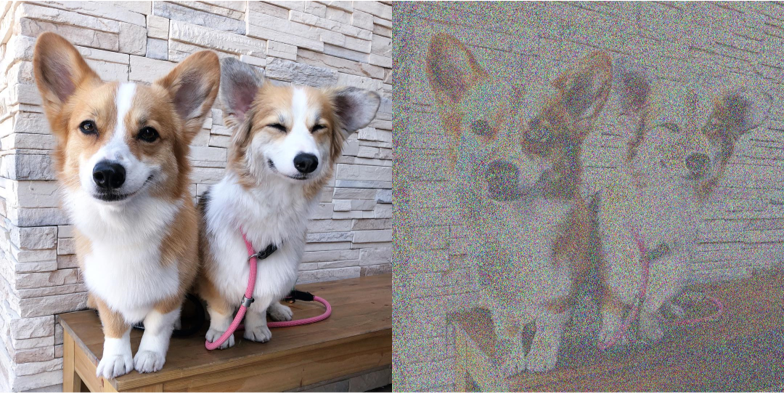
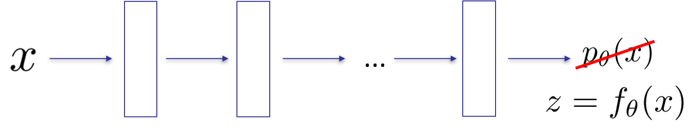
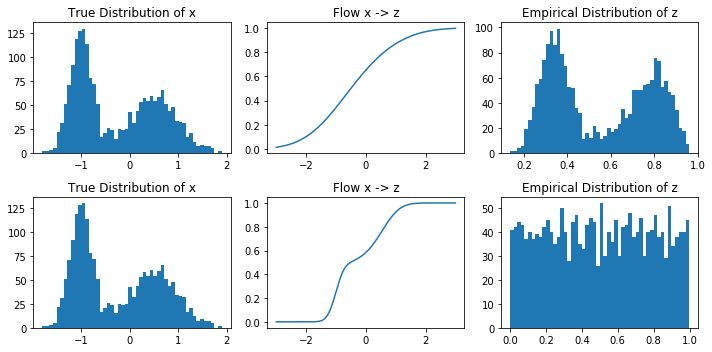
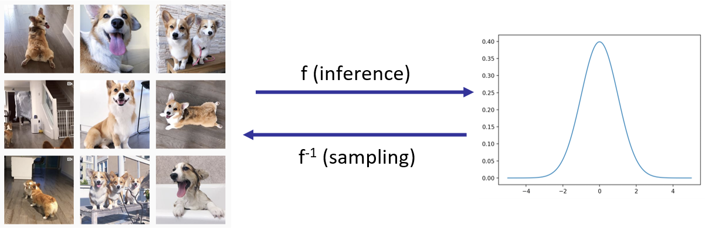
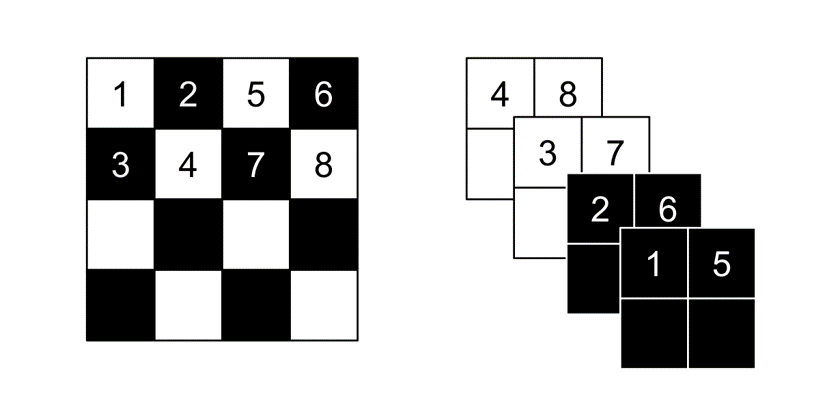
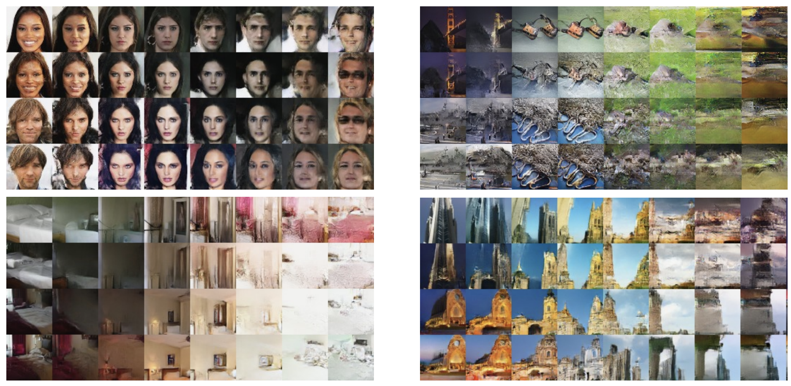

### 1 本节目标

- 如何拟合一个概率密度模型$p_\theta(x)$，其中$x$为*连续*变量

- 希望从模型中得到什么？
  - 训练：拟合训练数据
  - 评估：给与一个新点$x$给出其概率$p_\theta(x)$
  - 采样：从概率中得出新的样本
  - 表示：学习出有意义的*隐变量*表示

*斜体表示与上节课自回归模型的区别*

### 2 流模型的建立(1维)

#### 2.1 拟合概率密度模型 MLE

- 极大似然等价于最小化损失函数

  $\max \limits_{\theta}\sum \limits_{i}{\log p_\theta(x)}=\min \limits_{\theta}\mathbb{E}[{-\log p_\theta(x)}]$

- **举例**：

  - 解高斯混合模型时：

    $p_\theta(x)=\sum \limits_{i}^{k}\pi_i \mathcal{N}(x;\mu_i,\sigma_i^2)$

    $\theta=(\pi,\dots,\pi_k,\mu_1,\dots,\mu_k,\sigma_1,\dots,\sigma_k)$

  - 高维数据情况下，GMM还work吗？

    采样：1.选取聚类中心 2.添加高斯噪声

    如果数据是图像，当图像正好位于聚类中心时，采样出的图片才可能清晰。一般采样时添加的高斯噪声会使得图像模糊失真，如下图

    

#### 2.2 拟合一般概率密度

- 流模型(Flow-based model):$x$为数据样本，通过例如多层nn来不断转换这个变量，最终映射到$z$

- $z$也是一个连续值，来自于某个概率分布$p_Z(z)$。
- 如果迫使$z$服从标准正态分布，则称这个模型为**归一化流**(Normalizing Flow)
- 流模型把一个复杂分布中的样本$x$转化为了经典概率分布的样本$z$

#### 2.3 训练

- 依然是极大似然

  $\max \limits_{\theta}\sum \limits_{i}{\log p_\theta(x)}$

- 变量替换
  - $z=f_{\theta}(x)$
  - $p_\theta(x)dx=p(z)dz$
  - $p_\theta(x)=p(f_{\theta}(x))\left|\frac{\partial f_{\theta}(x)}{\partial x}\right|$
  - 注：这里需要$f_{\theta}(\cdot)$是可逆的，可微的。要求可逆因为需要求变换的雅克比行列值不为0

- MLE:

  $$\begin{eqnarray}&&\max \limits_{\theta}\sum \limits_{i}{\log p_\theta(x^{(i)})}\nonumber\\=&&\max \limits_{\theta}\sum \limits_{i}\log p_{Z}(f_{\theta}(x^{(i)}))+\log \left|\frac{\partial f_{\theta}(x^{(i)})}{\partial x}\right|\nonumber\end{eqnarray}$$

  已知$p_Z(z)$表达式，优化使用SGD

#### 2.4 采样

- 1)采样$z$
- 2)执行逆变换$x=f_{\theta}^{-1}(z)$

#### 2.5 举例

- 把$x$映射到均匀分布

- 把$x$映射到Beta(5,5)分布

#### 2.6 变换$f$的选取 &通用性

- 简单情况下$f$可选某一熟悉分布的累计密度函数CDF,即满足可逆、可微；
- $f$可选神经网络，满足可逆可微即可。
- 累计密度函数CDF将任意分布变换到U(0,1)均匀分布。
- 流的逆变换仍然是流，所以流模型可以将任意分布变换到均匀分布再变换到任意分布

### 3 2D自回归流模型

- 结合上节课自回归模型内容，将其引入到流模型中，对高维变量进行建模。
  - $x_1\rightarrow z_1=f_{\theta}(x_1)$
  - $x_2\rightarrow z_2=f_{\theta}(x_1,x_2)$

- 注释：自回归流的MLE可拆分为以下几项(略去对样本的求和号)

  $$\begin{eqnarray}& &\log p_{Z}(z_1,z_2)+\log \left|\frac{\partial \boldsymbol{z}}{\partial \boldsymbol{x}}\right|\nonumber\\&=&\log p_{Z}(z_1)+\log p_Z(z_2|z_1)+\log  \left|\begin{array}{cc}     \frac{\partial z_1}{\partial x_1} &    \frac{\partial z_1}{\partial x_2}     \\     \frac{\partial z_2}{\partial x_1} &    \frac{\partial z_2}{\partial x_2}    \end{array}\right| \nonumber\\&=& \log p_{Z}(z_1)+\log p_Z(z_2|z_1)+\log \left|\begin{array}{cc}     \frac{\partial z_1}{\partial x_1} &    0     \\     * &    \frac{\partial z_2}{\partial x_2}    \end{array}\right| \end{eqnarray}$$

  - 前两项是$z_1 ,z_2$的CDF值，后一项因为$z_1$与$x_2$无关。所以雅克比行列式只计算主对角线乘积即可。

- **举例**：将笑脸分布映射到均匀分布

  - 原数据样本-->映射到均匀分布-->模型计算数据的概率密度

  

### 4 N维流模型

- 将流模型扩展到高维数据情形下，对数据与已知经验分布进行互相转化
- **限制**：要求数据与隐变量空间维度相同(因为雅克比行列式的限制)

#### 4.1 自回归流与逆自回归流

- 自回归流**推断**，数据$\boldsymbol{x}$已知，可前向映射到$\boldsymbol{z}$：
  - $$z_1 = f_\theta(x_1) \\z_2 = f_\theta(x_2; x_1) \\z_3 = f_\theta(x_3; x_1, x_2) $$

- 自回归流**采样**，是上式推断的逆过程($f$全部换为$f^{-1}$)。需要按照维数依次采样$\boldsymbol{x}$：
  - $x_1 = f_\theta^{-1}(z_1) \\x_2 = f_\theta^{-1} (z_2; x_1)\\x_3 = f_\theta^{-1}(z_3; x_1, x_2) $

- 逆自回归流(**inverse autoregressive flow (IAF)**)训练困难(自回归流采样中$x,z$互换)
  - $$z_1 = f^{-1}_\theta(x_1) \\z_2 = f^{-1}_\theta(x_2; z_1) \\z_3 = f^{-1}_\theta(x_3; z_1, z_2) $$

- IAF采样方便(自回归流**推断**中$x,z$互换)，隐变量$\boldsymbol{z}$服从模型分布，采样时$\boldsymbol{z}$已知：
  - $x_1 = f_\theta(z_1) \\x_2 = f_\theta (z_2; z_1)\\x_3 = f_\theta(z_3; z_1, z_2) $IAF模型快速采样代表模型(*Parallel WaveNet*, *IAF-VAE*)

#### 4.2 Flow模型的训练

- x的概率密度估计

  $$p_{\theta}(\mathbf{x})=p\left(f_{\theta}(\mathbf{x})\right) \left| \operatorname{det} \frac{\partial f_{\theta}(\mathbf{x})}{\partial \mathbf{x}} \right |$$

- MLE: 需要Jacobian易于计算

  $$\arg \min _{\theta} \mathbb{E}_{\mathbf{x}}\left[-\log p_{\theta}(\mathbf{x})\right]=\mathbb{E}_{\mathbf{x}}\left[-\log p\left(f_{\theta}(\mathbf{x})\right)-\log \operatorname{det}\left|\frac{\partial f_{\theta}(\mathbf{x})}{\partial \mathbf{x}}\right|\right]$$

- Flow模型的级联

  - $\mathbf{x}\rightarrow f_1\rightarrow f_2\rightarrow \dots f_k\rightarrow \mathbf{z}$
  - $\mathbf{z}=f_k(f_{k-1}(\dots f_1(\mathbf{x})))$

  - $\mathbf{x}=f_1^{-1}(f_{2}^{-1}(\dots f_k^{-1}(\mathbf{z})))$

  - $$\log p_{\theta}(\mathbf{x})=\log p_{\theta}(\mathbf{z})+\sum \limits_{i=1}^{k} \log \left|\operatorname{det} \frac{\partial f_{i}}{\partial f_{i-1}}\right|$$

#### 4.3 流模型举例

- 仿射(Affine)流
  - 也称为高斯流，参数化形式为$f(\mathbf{x})=\mathbf{A}^{-1}(\mathbf{x}-\mathbf{b})$
  - 采样：$\mathbf{x}=\mathbf{Az}+\mathbf{b}$,$\mathbf{x}$来自于标准高斯分布$\mathbf{z}\sim\mathcal{N}(\mathbf{0},\mathbf{I})$
  - 不适用于高维数据($\mathbf{A}$太大不便于计算)

- Elementwise flows

  - 只有对应维度有关：$f_\theta((x_1, \dotsc, x_d)) = (f_\theta(x_1), \dotsc, f_\theta(x_d))$

  - 雅克比易于计算，但是限制了模型表达能力

- 仿射耦合层

  - 将变量按照维度切分为两部分：
    - $\mathbf{x}_{1:d/2},\mathbf{x}_{d/2+1:d}$
    - $\mathbf{z}_{1:d/2} = \mathbf{x}_{1:d/2} $
    - $\mathbf{z}_{d/2+1:d} = \mathbf{x}_{d/2+1:d} \odot s_\theta(\mathbf{x}_{d/2+1:d}) + t_\theta(\mathbf{x}_{d/2+1:d}) $, $\odot$逐元素相乘

  - 变换可逆！${s}_\theta,{t}_\theta$可为任意神经网络

  - 雅克比行列式为：求导只与${s}_\theta$有关

    $$ \frac{\partial \mathbf{z}}{\partial \mathbf{x}} = \begin{bmatrix}I &0 \\\frac{\partial \mathbf{z}_{d/2+1:d}}{\partial \mathbf{x}_{1:d/2}} & \mathrm{diag}(s_\theta(\mathbf{x}_{1:d/2}))\end{bmatrix}$$

  - Real NVP对图片分奇偶位置拆分为2，后缩小尺寸扩展通道。对应位置像素值转换关系如下图。

    

  - Real NVP 数据采样结果[Dinh et al. Density estimation using Real NVP. ICLR 2017]

    

- 更加复杂的流模型

  - 上述转换大部分都是仿射变换(NICE, RealNVP, IAF-VAE)

    $\mathbf{x}_i = \mathbf{z}_i \cdot \mathbf{a}_\theta(\mathrm{parent}(\mathbf{x}_i)) + \mathbf{b}_\theta(\mathrm{parent}(\mathbf{x}_i))$

  - 更加复杂的模型是非线性转换，会带来更好的性能
    - 将概率的CDF作为转换关系(Flow++)
    - 片级线性/二次变换(神经重要性采样)
    - 更加复杂的模型:可逆的1x1卷积(Glow), 连续时间流(FFJORD)

- 去量化：拟合离散分布时，可能出现在某位置处概率值极高，而其他位置概率值较小的情况，此时log似然也比较高。去量化：在输入数据中加入均匀分布的噪声然后拟合。

### 5 未来方向

- 快速推断、采样、训练
- 采样出高质量的样本，更好的压缩(数据似然的bpd)

### 6 参考文献

- NICE: Dinh, Laurent, David Krueger, and Yoshua Bengio. "NICE: Non-linear independent components estimation." *arXiv preprint arXiv:1410.8516* (2014).

- RealNVP: Dinh, Laurent, Jascha Sohl-Dickstein, and Samy Bengio. "Density estimation using Real NVP." *arXiv preprint arXiv:1605.08803* (2016).

- AF:Chen, Xi, et al. "Variational lossy autoencoder." *arXiv preprint arXiv:1611.02731* (2016).; Papamakarios, George, Theo Pavlakou, and Iain Murray. "Masked autoregressive flow for density estimation." *Advances in Neural Information Processing Systems*. 2017.

- IAF: Kingma, Durk P., et al. "Improved variational inference with inverse autoregressive flow." *Advances in neural information processing systems*. 2016.

- Flow++: Ho, Jonathan, et al. "Flow++: Improving Flow-Based Generative Models with Variational Dequantization and Architecture Design." *arXiv preprint arXiv:1902.00275* (2019).

- Neural Importance Sampling: Müller, Thomas, et al. "Neural importance sampling." *arXiv preprint arXiv:1808.03*

- Glow: Kingma, Durk P., and Prafulla Dhariwal. "Glow: Generative flow with invertible 1x1 convolutions." *Advances in Neural Information Processing Systems*. 2018.

- FFJORD: Grathwohl, Will, et al. "Ffjord: Free-form continuous dynamics for scalable reversible generative models." *arXiv preprint arXiv:1810.01367* (2018).

- Neural Autoregressive Flow: Huang, Chin-Wei, et al. "Neural autoregressive flows." arXiv preprint arXiv:1804.00779 (2018)

- Residual Flows for invertible generative modeling, Ricky T. Q. Chen, Jens Behrmann, David Duvenaud, Jörn-Henrik Jacobsen, arXiv: 1906.02735

- Normalizing Flows for Probabilistic Modeling and Inference, George Papamakarios, Eric Nalisnick, Danilo Jimenez Rezende, Shakir Mohamed, Balaji Lakshminarayanan https://arxiv.org/abs/1912.02762 [tutorial]

