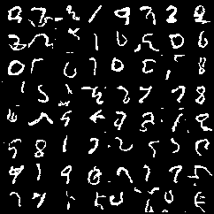
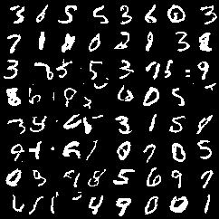

### 1. 动机

#### 1.1 需要解决的问题

- 生成数据：人工合成的图片视频、音频、文本
- 压缩数据：构建高效的编码
- 异常检测

#### 1.2 基于似然的模型：从来自于真实分布$p_{data}$的数据样本$x^{(1)},\cdots,x^{(n)}$来估计$p_{data}$

学习数据分布可以计算任意样本的概率值并且采样生成新的样本

例如需要学习数据分布：[128,128,3]RGB图像数据在接近50000维的空间中分布

需要模型具有的属性：

- 高效训练、高效的模型表达；
- 丰富的表达能力与生成能力
- 可高效快速采样($\textcolor{green}{并行采样}$)
- 压缩比与压缩速度

### 2. 简单的生成式模型：$\textcolor{blue}{频率分布直方图}$

回顾一下：目标是从来自于真实分布$p_{data}$的数据样本$x^{(1)},\cdots,x^{(n)}$来估计$p_{data}$

假设数据会在一个有限的集合内取值$\{1,\cdots,k\}$


#### 2.1 模型：*频率分布直方图*

\- 概率的可能值有k个：$p_1,\cdots,p_k$

\- 模型训练：统计频率

$$
\begin{eqnarray} 
p_i=\frac{i类数据出现次数}{数据集大小}
\end{eqnarray}
$$


\- **推断**：直接查看概率值$p_1,\cdots,p_k$

\- **采样**：(借助累计密度分布函数CDF的逆函数)

---1) 计算累计密度分布函数
$$
F_i=p_1+\cdots+p_i  \quad \forall i \in\{1,\cdots,k\}
$$
---2) 从均匀分布中采样 $u\sim [0,1]$

---3) 返回使得$u\leq F_i$成立最小的i

**维度灾难**：直方图作为生成式模型不适用于高维数据

\- MNIST 单个数据维度$28\times28$，每个像素取{0,1}；

\- 离散的看全部空间有$2^{784}$个概率值需要统计；

\- 合理的训练集数据仅仅存在于上述空间中的一部分(稀疏性，流形)；

\- 模型没有什么生成新数据的能力；

\- 训练集与测试集直方图存在偏差。

### 3 基于似然函数的生成式模型

**思路**：不直接存储每个样本的概率值，而已使用一个含参的函数$p_{\theta}(x)$去近似概率密度函数

在保持易于训练的同时，如何设计函数逼近器表达复杂的联合分布？

模型设计时有很多选择，有着众多的权衡与模型表达能力的评价标准

#### 3.1 拟合分布

**步骤**

\- 数据集是来自于真实分布$p_{data}$的数据样本$x^{(1)},\cdots,x^{(n)}$

\- 设计一个参数化的分布$p_{ \theta}$

\- 寻找参数优化损失函数
$$
\arg \min_{\theta} loss(\theta,x^{(1)},\cdots,x^{(n)})
$$
希望损失函数与优化过程具有以下属性：

- 可在大规模数据集上有效(百万样本量的数据集)

- 得出的$p_{\theta}$要接近于真实分布$p_{data}$
- 训练结束得到的只是经验分布，并不是真实分布。希望模型具有一定生成能力

#### 3.2 极大似然估计 MLE

- 极大似然估计：解以下优化问题

$$
\arg \min_{\theta} loss(\theta,x^{(1)},\cdots,x^{(n)})=\frac{1}{n}\sum_{i=1}^{n}-\log p_{\theta}(x^{(i)})
$$

统计学上讲如果模型表达能力足够且拥有足够的数据，那么解极大似然估计问题就可得到生成新数据所需要的模型参数

- 解极大似然等价于最小化数据分布与模型分布间的KL散度 
  $$
  \arg\max_{\theta} \mathbb{E}_{x\sim p_{data}[\log p_{model}(x;\theta)]}=\arg\min_{\theta}KL(p_{data}||p_{model})
  $$

#### 3.3 学习算法 随机梯度下降法SGD

Stochastic Gradient Descent (SGD)

- SGD最小化期望损失，对于一个可微函数$f(\theta)$
  $$
  \arg \min_{\theta}\mathbb{E}[f(\theta)]
  $$

- 解极大似然法，优化问题如下
  $$
  \arg\min_{\theta} \mathbb{E}_{x\sim p_{data}}[-\log p_{model}(x;\theta)]
  $$
  选择SGD的原因: 适用于大规模数据集与神经网路

#### 3.4 模型设计

- MLE与SGD的核心是高效计算 $\log p(x)$

- 我们将把$p_{\theta}$设计为深度神经网络(DNN)，DNN具有高效的表达能力，且可在GPU等设备上加速运算

- 如何设计这些网络？

  - 要保证模型概率分布归一化且恒为非负值
    $$
    \forall{i},\sum_{x}p_{\theta}(x)=1  \quad and \quad p_{\theta}(x) \geq0, \forall{x}
    $$

  - $\log p_{\theta}(x)$易于计算且求导

    

### 4 自回归模型

#### 4.1 Autoregressive models概念

- 使用神经网络建模条件概率分布将会产生一个可解的log-likelihood并且可计算梯度

$$
\log p_{\theta}(\mathbf{x})=\sum_{i=1}^{d} \log p_{\theta}\left(x_{i} \mid \operatorname{parents}\left(x_{i}\right)\right)
$$

- 结合概率公式中的链式法则
  $$
  \log p(\mathbf{x})=\sum_{i=1}^{d} \log p\left(x_{i} \mid \mathbf{x}_{1: i-1}\right)
  $$

- 通过神经网络建模条件概率分布，整体表达一个贝叶斯网络，这就是自回归模型。

  **举例：**

  数据集：$x_1,x_2$

  模型：$p(x_1,x_2)=p(x_1)p(x_2|x_1)$

  - 假设$p(x_1)$是频率分布直方图
  - 假设$p(x_2|x_1)$是多层感知机
    - 输入是$x_1$
    - 输出是$x_2$的分布(逻辑值，后接Softmax层归一化)

#### 4.2 权值共享

引入权值共享的两点原因

- 文本生成时，参数量过多

- 对建模条件概率分布的神经网络上加入权值共享，促使信息共享

两个权值共享模型的代表：

- 递归神经网络(Recurrent neural networks)
- 掩膜 (Masking)

#### 4.3 自回归模型 $\textcolor{blue}{Char-RNN}$

$$
\log p(\mathbf{x})=\sum_{i=1}^{d}\log p(x_i|\mathbf{x_{1:i-1}})
$$

$\mathbf{x}$为一个样本的字母序列


<center>Char-RNN[Karpathy, 2015] 同色箭头代表权值共享

- **举例**

  MNIST手写数字生成(图像二值化)

  数据集：尺寸28×28，样本60000训练集，10000测试集

  

<center>二值化MNIST数据集

- 模型代码如下

```Python
class RNN_Example(nn.Module):

    def __init__(self, device, append_loc=False, input_shape=(1, 28, 28), hidden_size=256):
        super().__init__()
        self.device = device
        self.append_loc = append_loc 
        self.input_channels = input_shape[0] + 2 if append_loc else input_shape[0]
        self.hidden_size = hidden_size
        self.input_shape = input_shape
        self.canvas_size = input_shape[1] * input_shape[2]

        self.lstm = nn.LSTM(self.input_channels, self.hidden_size, num_layers=1, batch_first=True)
        self.fc = nn.Linear(self.hidden_size, input_shape[0])

    def nll(self, x):
        # 前向传播
        batch_size = x.shape[0]
        x_inp = append_location(x, self.device) if self.append_loc else x

        # 数据右移一位，作为输入序列
        x_inp = x_inp.permute(0, 2, 3, 1).contiguous().view(batch_size, self.canvas_size, self.input_channels)
        x_inp = torch.cat((torch.zeros(batch_size, 1, self.input_channels).to(self.device), x_inp[:, :-1]), dim=1)

        h0 = torch.zeros(1, x_inp.size(0), self.hidden_size).to(self.device)
        c0 = torch.zeros(1, x_inp.size(0), self.hidden_size).to(self.device)

        # 输入序列-->LSTM
        out, _ = self.lstm(x_inp, (h0, c0))  

        # 全连接网络解码获取输出序列
        out = self.fc(out).squeeze(-1) # b x 784

        return F.binary_cross_entropy_with_logits(out, x.view(batch_size, -1))


    def sample(self, n):
        # 采样生成数据
        with torch.no_grad():
            samples = torch.zeros(n, 1, self.input_channels).to(self.device)
            h = torch.zeros(1, n, self.hidden_size).to(self.device)
            c = torch.zeros(1, n, self.hidden_size).to(self.device)

            for i in range(self.canvas_size):
                x_inp = samples[:, [i]]
                out, (h, c) = self.lstm(x_inp, (h, c))
                out = self.fc(out[:, 0, :])
                prob = torch.sigmoid(out)
                # 伯努利分布对输出预测采样
                sample_pixel = torch.bernoulli(prob).unsqueeze(-1) 
                if self.append_loc:
                    loc = np.array([i // 28, i % 28]) / 27
                    loc = torch.FloatTensor(loc).to(self.device)
                    loc = loc.view(1, 1, 2).repeat(n, 1, 1)
                    sample_pixel = torch.cat((sample_pixel, loc), dim=-1)
                samples = torch.cat((samples, sample_pixel), dim=1)

            if self.append_loc:
                samples = samples[:, 1:, 0] 
            else:
                samples = samples[:, 1:].squeeze(-1) # n x 784
            samples = samples.view(n, *self.input_shape)
            return samples.cpu()

```

- 字符生成结果如下

<center> <figure> 
    
     
     
     
     
    </figure> </center>
<center>epoch 0 1 3 9 20采样结果

- 输入输出序列加入坐标编码时，字符生成结果如下

<center> <figure> 
      
    
     
     
     
    </figure> </center>

<center>epoch 0 1 3 9 20采样结果

#### 4.4  $\textcolor{blue}{MADE}$: 带有mask的自编码器

<center> <figure> 
    
    </figure> </center>
<center>masked autoencoder for distribution estimation

- 每层的输出神经元只与数字比它低或者相等的前一层连接(二值化的mask)，保证概率的chain rule.

- 例：上图$p(x_3|x_2)$被标记为2，只与前一层被标记为1的层连接，依次溯源到输入，这一项只与$x_2$有关，而与$x_1,x_3$无关。同理$p(x_1|x_2,x_3)$溯源到输入只与$x_2,x_3$有关
- 模型代码

```python
class MaskedLinear(nn.Linear):
    """ 带有mask的全连接层 """
    def __init__(self, in_features, out_features, bias=True):
        super().__init__(in_features, out_features, bias)
        self.register_buffer('mask', torch.ones(out_features, in_features))

    def set_mask(self, mask):
        self.mask.data.copy_(torch.from_numpy(mask.astype(np.uint8).T))

    def forward(self, input):
        return F.linear(input, self.mask * self.weight, self.bias)

class MADE_Example(nn.Module):
    def __init__(self, device):
        super().__init__()
        self.nin = 784
        self.nout = 784
        self.hidden_sizes = [512, 512, 512]
        self.device = device

        # 定义网络结构
        self.net = []
        hs = [self.nin] + self.hidden_sizes + [self.nout]
        for h0, h1 in zip(hs, hs[1:]):
            self.net.extend([
                MaskedLinear(h0, h1),
                nn.ReLU(),
            ])
        self.net.pop()  
        self.net = nn.Sequential(*self.net)

        self.m = {}
        self.create_mask()  # 建立初始连接，带mask

    def create_mask(self):
        L = len(self.hidden_sizes)

        # 采样生成每个神经元的标号
        self.m[-1] = np.arange(self.nin)
        for l in range(L):
            self.m[l] = np.random.randint(self.m[l - 1].min(), self.nin - 1, size=self.hidden_sizes[l])

        # 构建mask矩阵
        masks = [self.m[l - 1][:, None] <= self.m[l][None, :] for l in range(L)]
        masks.append(self.m[L - 1][:, None] < self.m[-1][None, :])

        # 将mask应用于全连接网络
        layers = [l for l in self.net.modules() if isinstance(l, MaskedLinear)]
        for l, m in zip(layers, masks):
            l.set_mask(m)

    def nll(self, x):
        x = x.view(-1, 784) 
        logits = self.net(x)
        return F.binary_cross_entropy_with_logits(logits, x)

    def sample(self, n):
        samples = torch.zeros(n, 784).to(self.device)
        with torch.no_grad():
            for i in range(784):
                logits = self.net(samples)[:, i]
                probs = torch.sigmoid(logits)
                samples[:, i] = torch.bernoulli(probs)
            samples = samples.view(n, 1, 28, 28)
        return samples.cpu()
```

- 生成结果

<center> <figure> 
    
    </figure> </center>
<center>MADE生成结果(左)与生成结果最接近的MNIST图片(右)

#### 4.5 Wavenet: 带有mask的1D卷积

- 语音信号采样率高，自回归模型计算效率低
- 传统卷积感受野受限，为了扩大感受野，在Wavenet上使用扩张卷积，浅层即可捕获较长段输入序列
- 输出作为下一时刻输入


<center>Wavenet中的扩张卷积

- Wavenet网络结构上还对输出进行了类似LSTM中的门控操作(下图的$\sigma$与tanh输出相乘)

- 使用中间层结果相加，后经过1×1卷积层作为输出

  <center> 
      
  <center>Wavenet 结构

- 生成结果如下(输入不包括位置编码)：
  
  - 生成结果很差

<center> <figure> 
      
    
     
     
     
    </figure> </center>
<center>epoch 0 1 3 9 20采样结果

- 生成结果如下(输入包括位置编码)：

<center> <figure> 
    
     
     
     
      
    </figure> </center>
<center>epoch 0 1 3 9 20采样结果

#### 4.6 PixelCNN: 带有mask的2D卷积

- 2D自回归，光栅式扫描

<center> 
    
<center>2D自回归(像素级)

- 卷积核上使用mask，使得预测像素之于之前产生的像素有关

<center>
         <br>
    卷积核上的掩膜

- 上述mask感受野有盲点

  <center>
      <center>上图mask无法采集图像右下方的像素
              <center>颜色由深到浅表示感受野随着层数叠加的增长方式

- GatedPixelCNN解决盲点问题

  - 垂直叠加：当前预测点感受野为上侧所有行
  - 水平叠加：当前预测点感受野为左侧所有点
  - 垂直网络中的特征会被融合到水平网络中
  - Pixel CNN网络也使用了类似Wavenet中用到的门控结构、残差连接和1×1卷积

  <center>
      <center>无盲点感受野增长方式

### 5 Attention注意力

- CNN缺点是感受野受限，RNN缺点难以捕获数据中的远距离关系

- 新的模型：自注意力Self-Attention

  - 无限制的感受野/在某个神经元上接收整个数据样本

  - 并行计算(相比RNN)

  - 卷积是层与层之间局部连接，自注意力是让神经网络学习下一层神经元应该更多关注上一次的哪些位置

    <center>
        <br>卷积(左)与自注意力(右)

  - 自注意力计算方式
    - 对于输入序列的每个位置，用nn前向计算产生q,k,v三个向量，分别叫做query, key, value；
    - 计算query与key的某种相似性度量，这里是计算內积，结果值越大表示越相关；
    - 对上一步內积结果进行softmax操作，使相关性的度量归一化；
    - 使用上一步归一化后的权重对value加权求和。
  - 解释：使用nn计算出了原本nn模型参数上的权重，完成了所谓的注意力。让模型自动去关注输入序列的哪些位置是有关联的。
  - 同层同位置有多个key, qurey, value时，称为多头自注意力

<center><br>
自注意力计算方式

- 感受野对比，Self-Attention使用较少层即可获得较大感受野

  <center>
          
          <br>
     <center> GatedPixelCNN, PixelCNN++, Self-Attention感受野

### 6 自回归模型的发展

- 提升生成数据质量
- 有条件的生成某类数据
- 应用：超分辨率，着色
- 提升采样速度
  - 缓存中间计算结果
  - 数据分组采样(非完全自回归)

- 获取自回归模型中数据的潜在表示(Fisher分数)

### 7 参考文献

- char-rnn: http://karpathy.github.io/2015/05/21/rnn-effectiveness/

- MADE: Germain, Mathieu, et al. "Made: Masked autoencoder for distribution estimation." *International Conference on Machine Learning*. 2015.

- WaveNet: Oord, Aaron van den, et al. "Wavenet: A generative model for raw audio." *arXiv preprint arXiv:1609.03499* (2016).

- PixelCNN: Oord, Aaron van den, Nal Kalchbrenner, and Koray Kavukcuoglu. "Pixel recurrent neural networks." *arXiv preprint arXiv:1601.06759* (2016).

- Gated PixelCNN: Van den Oord, Aaron, et al. "Conditional image generation with pixelcnn decoders." *Advances in Neural Information Processing Systems*. 2016.

- PixelCNN++: Salimans, Tim, et al. "Pixelcnn++: Improving the pixelcnn with discretized logistic mixture likelihood and other modifications." *arXiv preprint arXiv:1701.05517* (2017)

- Self-attention: Vaswani, Ashish, et al. "Attention is all you need." *Advances in Neural Information Processing Systems*. 2017.

- PixelSNAIL: Chen, Xi, et al. "Pixelsnail: An improved autoregressive generative model." *arXiv preprint arXiv:1712.09763* (2017)

- Fast PixelCNN++: Ramachandran, Prajit, et al. "Fast generation for convolutional autoregressive models." *arXiv preprint arXiv:1704.06001*(2017).

- Multiscale PixelCNN: Reed, Scott, et al. "Parallel multiscale autoregressive density estimation." *Proceedings of the 34th International Conference on Machine Learning-Volume 70*. JMLR. org, 2017.

- Grayscale PixelCNN: Kolesnikov, Alexander, and Christoph H. Lampert. "PixelCNN models with auxiliary variables for natural image modeling." *Proceedings of the 34th International Conference on Machine Learning-Volume 70*. JMLR. org, 2017. 

- Subscale Pixel Network: Menick, Jacob, and Nal Kalchbrenner. "Generating High Fidelity Images with Subscale Pixel Networks and Multidimensional Upscaling." *arXiv preprint arXiv:1812.01608*(2018)

- Dirk Weissenborn, Oscar Tackstrom, Jakob Uszkoreit. “Scaling Autoregressive Video Models.” arXiv 1906.02634 (2019)

- Sparse Attention: Rewon Child, Scott Gray, Alec Radford, Ilya Sutskever. “Generating Long Sequences with Sparse Transformers.” arXiv 1904.10509

- Wilson Yan, Jonathan Ho, Pieter Abbeel. “Natural Image Manipulation for Autoregressive Models using Fisher Scores.” arXiv 1912.05015

- PixelCNN Super Resolution: Dahl, Ryan, Mohammad Norouzi, and Jonathon Shlens. "Pixel recursive super resolution." *Proceedings of the IEEE International Conference on Computer Vision*. 2017.