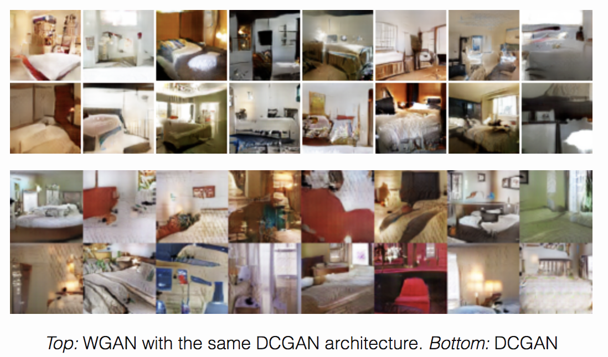

### 1 动机 隐式模型的定义

#### 1.1 前情回顾

到目前为止，本课程涉及到的一些模型如下

- 自回归模型：MADE, PixelRNN/CNN, Gated PixelCNN, PixelSNAIL
- 流模型：Autoregressive Flows, NICE, RealNVP, Glow, Flow++
- 隐变量模型：VAE, IWAE, VQ-VAE, VLAE, PixelVAE

这些模型都是会显式地建模似然函数：

- 直接优化似然函数(自回归模型与流模型)
- 优化似然的下界(VAE)

#### 1.2 生成式模型的要素

- 采样、评估(似然)、训练、表示
- 一个好的生成模型能够理解数据的分布:
  - 能够在训练样本之间进行平滑插值
  - 生成结果与训练数据相似但不相同
  - 生成样本可表征训练样本某种属性的变化
  - 例如，数字中缺失的笔画，脸的另一个侧面

#### 1.3 隐式模型

- 从随机变量中采样$z$，
- 由$z$通过神经网络产生$x$(与流模型/VAE类似)
- **不同之处在于隐式模型不对数据的似然进行建模**。

- 训练样本分布为$p_{data}:x_1,x_2,\cdots,x_n$
- 生成器生成样本分布为$p_{model}$，样本由$q_{\phi}(z)=\text{DNN}(z;\phi)$给出

- **目的**：优化$\phi$使得两个分布靠近。
- 两个分布距离指标：
  - 最大平均差异(maximum mean discrepancy, MMD)
  - JS散度(Jensen Shannon Divergence)
  - 推土机距离(Earth Mover's Distance)

### 2 原始GAN

#### 2.1 损失函数

$\min_\limits{G}\max_\limits{D}\mathbb{E}_{x\sim p_{data}}[\log D(x)]+\mathbb{E}_{z\sim p(z)}[\log(1-(D(G(z)))]$

- 生成器G与判别器D最大最小博弈
- (D)试图最大化二分类的log似然
  - data: real (1)
  - generated: fake (0)
- (G) 试图最小化被判别器D分类为假样本的概率

#### 2.2 GAN结构图

#### 2.3 GAN伪代码

- 优化k步D，优化一步G

- 示例网站:  https://poloclub.github.io/ganlab/

#### 2.4 GAN生成结果(2014)

- 每图左边几列是图片生成结果，最右一列为数据集中与右二列最接近的样本。

### 3 GAN的评价指标

- 这是个开放性问题，因为没有对似然进行显示建模

#### 3.1 核密度估计

- Kernel Density Estmator (KDE)

- $$\hat{p_h}(x) = \frac{1}{nh} \sum_i K\left(\frac{x - x_i}{h}\right)$$

- $K$通常取高斯核
- 这种评价指标不适合高维数据

#### 3.2 Inception 分数

- 评价指标来源：一个好的生成器生成的图片
  - 应该是具有区分度的，即生成结果输入到分类网络中，预测类别应该在某类上有较高分数，$p(y|x)$低熵；
  - 生成结果应该是多样的，即结果属于的类别较多，$p(y)$应高熵。

- 具体相关定义：

  - Inception分类网络$p(y|x)$

  - 标签的边缘分布$p(y) = \int_{x} p(y|x) p_g(x)$

  - Inception Score；

    $\begin{align}\mathrm{IS}(x) & =\mathrm{exp}(\mathbb{E}_{x\sim p_g}[{D_{KL}[{p(y|x)}||{p(y)}}]])\\&=   \mathrm{exp}(\mathbb{E}_{x\sim p_g, y \sim p(y|x)}[{ \log p(y|x) - \log p(y)}])\\&= \mathrm{exp}( H(y) - H(y|x) )\end{align}$

  - 下图对比中，图像越真实，IS得分越高

#### 3.3 Fréchet Inception Distance

- IS指标有自身缺点：如果生成样本为每类一例，则其IS值也很高。
- FID则计算训练数据与真实数据在特征空间上的均值与协方差是否相等
  - FID: $d^{2}\left((\boldsymbol{m}, \boldsymbol{C}),\left(\boldsymbol{m}_{w}, \boldsymbol{C}_{w}\right)\right)=\left\|\boldsymbol{m}-\boldsymbol{m}_{w}\right\|_{2}^{2}+\operatorname{Tr}\left(\boldsymbol{C}+\boldsymbol{C}_{w}-2\left(\boldsymbol{C} \boldsymbol{C}_{w}\right)^{1 / 2}\right)$

### 4 GAN背后的理论

#### 4.1 最优的判别器

- 如果给定生成器与真实数据分布，最优的判别器是什么？

$\begin{aligned}
V(G, D) &=\mathbb{E}_{x \sim p_{\text {data }}}[\log D(x)]+\mathbb{E}_{z \sim p(z)}[\log (1-D(G(z)))] \\
&=\int_{x} p_{\text {data }}(x) \log D(x) d x+\int_{z} p(z) \log (1-D(G(z))) d z \\
&=\int_{x} p_{\text {data }}(x) \log D(x) d x+\int_{x} p_{g}(x) \log (1-D(x)) d x \\
&=\int_{x}\left[p_{\text {data }}(x) \log D(x)+p_{g}(x) \log (1-D(x))\right] d x
\end{aligned}$

$\begin{array}{c}
\nabla_{y}[a \log y+b \log (1-y)]=0 \Longrightarrow y^{*}=\frac{a}{a+b} \quad \forall \quad[a, b] \in \mathbb{R}^{2} \backslash[0,0] \\
\Longrightarrow D^{*}(x)=\frac{p_{\text {data }}(x)}{\left(p_{\text {data }}(x)+p_{g}(x)\right)}
\end{array}$

- 如下图所示: 当生成样本位于真实数据样本分布的高概率区域时(即绿线分布中的样本处于黑色虚线值高的地方)，好的判别器会认为这些是真实样本；而生成真实数据分布低概率区域中的样本，判别器则认为这些是生成样本。

#### 4.2 当判别器最优时，生成器的目标函数

$\begin{aligned}
V\left(G, D^{*}\right) &=\mathbb{E}_{x \sim p_{\text {data }}}\left[\log D^{*}(x)\right]+\mathbb{E}_{x \sim p_{g}}\left[\log \left(1-D^{*}(x)\right)\right] \\
&=\mathbb{E}_{x \sim p_{\text {data }}}\left[\log \frac{p_{\text {data }}(x)}{p_{\text {data }}(x)+p_{g}(x)}\right]+\mathbb{E}_{x \sim p_{g}}\left[\log \frac{p_{g}(x)}{p_{\text {data }}(x)+p_{g}(x)}\right] \\
&=-\log (4)+\underbrace{K L\left(p_{\text {data }} \|\left(\frac{p_{\text {data }}+p_{g}}{2}\right)\right)+K L\left(p_{\mathrm{g}} \|\left(\frac{p_{\text {data }}+p_{g}}{2}\right)\right)}_{\left(\text {Jensen-Shannon Divergence }(\mathrm{JSD}) \text { of } p_{\text {data and }} p_{g}\right) \geq 0} \\
V\left(G^{*}, D^{*}\right) &=-\log (4) \text { when } p_{g}=p_{\text {data }}
\end{aligned}$

#### 4.3 模式崩溃

- Mode Collapse 是指在GAN的优化过程中，生成器容易产生类别单一的样本，导致生成结果失去多样性，如下图所示。

#### 4.3 判别器饱和

- Discriminator Saturation 是指判别器以很高的置信度将生成样本分类为假，导致更新生成器的梯度为0。
- 解决方法：
  
  - i) 交替更新G与D
  
   $\begin{array}{c}
  L^{(D)}\left(\theta_{D}, \theta_{G}\right)=-\mathbb{E}_{x \sim p_{\text {data }}}\left[\log D\left(x ; \theta_{D}\right)\right]-\mathbb{E}_{z \sim p(z)}\left[\log \left(1-D\left(G\left(z ; \theta_{G}\right), \theta_{D}\right)\right)\right] \\
  L^{(G)}\left(\theta_{D}, \theta_{G}\right)=\mathbb{E}_{z \sim p(z)}\left[\log \left(1-D\left(G\left(z ; \theta_{G}\right), \theta_{D}\right)\right)\right] \\
  \theta_{D}:=\theta_{D}-\alpha^{(D)} \nabla_{\theta_{D}} L^{(D)}\left(\theta_{D}, \theta_{G}\right) \\
  \theta_{G}:=\theta_{G}-\beta^{(G)} \nabla_{\theta_{G}} L^{(G)}\left(\theta_{D}, \theta_{G}\right)
  \end{array}$
  
  - ii)  非饱和式的公式(更新G时改变目标函数)
  
    $\begin{array}{c}
    L^{(D)}=-\mathbb{E}_{x \sim p_{\text {data }}}[\log D(x)]-\mathbb{E}_{z \sim p(z)}[\log (1-D(G(z)))] \\
    L^{(G)}=-L^{D} \equiv \min _{G} \mathbb{E}_{z \sim p(z)} \log (1-D(G(z)))
    \end{array}$
  
    变为
  
    $\begin{array}{l}
    L^{(D)}=-\mathbb{E}_{x \sim p_{\text {data }}}[\log D(x)]-\mathbb{E}_{z \sim p(z)}[\log (1-D(G(z)))] \\
    L^{(G)}=-\mathbb{E}_{z \sim p(z)} \log \left(D(G(z)) \equiv \max _{G} \mathbb{E}_{z \sim p(z)} \log (D(G(z))\right.
    \end{array}$
  
    当D输出接近0时，回传梯度较原来变大。

### 5 GAN的后续发展

#### 5.1 DCGAN

- 即Deep Convolutional GAN (DCGAN)将GAN中的全连接网络换成CNN，用以提升生成图片的质量
- 生成器网络结构图：

- DCGAN在网络层面有一些特殊的设计：
  - 移除了CNN中的池化层；
  - 在G中上采样部分，使用转置卷积；
  - G中使用ReLU，D中使用Leaky ReLU(0.2)
  - G的输出使用tanh，D的输出使用sigmoid
  - 引入BN层减轻模式崩溃
- DCGAN生成结果

- 隐变量对应图像上的语义、属性，对隐变量插值结果

- DCGAN总结
  - 生成样本质量显著提升(尺寸。分辨率、逼真程度)
  - 引入其他网络结构可进一步提升GAN
  - 隐变量插值、语义表征方面
  - 以无监督方式学习特征表示
  - **仍存在的问题**：
    - 训练不稳定
    - 需要精心设计结构与超参数

#### 5.2 Improved GAN

- 训练GAN的技巧

  - 特征匹配(Feature Matching)：真实样本的特征与生成样本的特征应一致，训练生成器时使用如下目标函数:

    $\left\|\mathbb{E}_{x \sim p_{\text {data }}} f(x)-\mathbb{E}_{z \sim p(z)} f(G(z))\right\|^{2}$

  - 小批量判别(minibatch discrimination)：用于解决模式崩溃问题，迫使同一批样本内部特征不相同。

     $c_{b}\left(\boldsymbol{x}_{i}, \boldsymbol{x}_{j}\right)=\exp \left(-\left\|M_{i, b}-M_{j, b}\right\|_{L_{1}}\right)$

  - 历史平均(historical averaging)：在损失函数中引入模型参数与历史平均值的差，利于寻找博弈的均衡点。

    $\left\|\boldsymbol{\theta}-\frac{1}{t} \sum_{i=1}^{t} \boldsymbol{\theta}[i]\right\|^{2}$

  - 单边标签平滑(one-sided label smoothing)：在判别器中，原来训练数据的标签为1，更改为0.9(减小梯度稳定训练)。
  - 虚拟BN：BN虽然对于训练神经网络非常有用，但是它会使得网络输出受限于一批数据的统计量，导致生成结果类似。虚拟BN则提前设定一批虚拟样本，并且计算其均值与标准差进行BN操作。

- **生成式模型应用于半监督学习**: 

  - 在半监督学习分类任务中，一部分数据包含类别标签，另一部分数据无标签；

  - 此处旨在使用无监督学习数据的表征；
  - 在训练分类器时，额外添加一个类别为假(第$K+1$类)；
    - 含有类别的真实数据，按照原来的交叉熵损失($L_{\text {supervised }}$)进行训练；
    - 不含类别的真实数据，则将其分类为真数据(判断为假类别概率最小, $L_{\text {unsupervised }}$前半部分)；
    - 生成数据判断为假类别概率最大($L_{\text {unsupervised }}$后半部分)；

$\begin{aligned}
L &=-\mathbb{E}_{\boldsymbol{x}, y \sim p_{\text {data }}(\boldsymbol{x}, y)}\left[\log p_{\text {model }}(y \mid \boldsymbol{x})\right]-\mathbb{E}_{\boldsymbol{x} \sim G}\left[\log p_{\text {model }}(y=K+1 \mid \boldsymbol{x})\right] \\
&=L_{\text {supervised }}+L_{\text {unsupervised }}, \text { where } \\
L_{\text {supervised }} &=-\mathbb{E}_{\boldsymbol{x}, y \sim p_{\text {data }}(\boldsymbol{x}, y)} \log p_{\text {model }}(y \mid \boldsymbol{x}, y<K+1) \\
L_{\text {unsupervised }} &=-\left\{\mathbb{E}_{\boldsymbol{x} \sim p_{\text {data }}(\boldsymbol{x})} \log \left[1-p_{\text {model }}(y=K+1 \mid \boldsymbol{x})\right]+\mathbb{E}_{\boldsymbol{x} \sim G} \log \left[p_{\text {model }}(y=K+1 \mid \boldsymbol{x})\right]\right\}
\end{aligned}$

#### 5.3 WGAN

- 由以上4.2分析可知，当判别器最优时，生成器是在优化训练数据分布与生成分布之间的JS散度。

事实上JS散度并不是一个好的目标函数。例如下图所示，$p(x)$为目标分布，$q(x)$为优化出的分布，以JS散度为目标函数时，可能导致分布失去多样性(绿色分布只有一个峰值)。

- 所以需要寻找一种新的目标函数度量两个分布之间的相似性。由此引入了最优传输理论中的推土机距离(Earth Mover Distance),定义如下

  $$W(P_r,P_g)=\inf_\limits{\gamma\sim\Pi(P_r,P_g)}\mathbb{E}_{(x,y)\sim\gamma}[||x-y||]$$

  其中$\gamma$为任意两分布$P_r,P_g$的联合分布，从联合分布中采样出$x,y$，计算差值取范数、取期望。函数值下界即为Wasserstein距离。

  - 因为难以穷举两分布的联合分布，所以将上式距离转化为对偶问题进行求解(Kantorovich Rubinstein Duality)，经过对偶转化W距离被转化为如下形式

    $$W(P_r,P_g)=\sup_\limits{||f_L||\leq 1}\mathbb{E}_{x\sim P_r}[f(x)]-\mathbb{E}_{x\sim P_g}[f(x)]$$

    经过转化，现在不用在分布中搜索解，转而寻找一个非线性函数$f(x)$，要求此函数满足1-Lipschitz条件。

    K-Lipschitz定义为：如果一个映射$f:X\rightarrow Y$满足$d_Y(f(x_1),f(x_2))\leq Kd_X(x_1,x_2)$则称此函数满足K-Lipschitz条件，其中$d_X,d_Y$是距离度量函数(可取范数)。

- WGAN伪代码

  在WGAN中通过对神经网络权重幅值裁剪来约束神经网络满足Lipschitz连续性条件。

- 优化结果

  - 损失函数

    原始DCGAN损失函数

  

  ​		WGAN损失函数(训练更加稳定)

  

  - 生成图片结果

    WGAN相较于原始DCGAN在克服模式崩溃/网络结构鲁棒性方面都有所提升，具体可参考论文。

    

- WGAN总结

  - 目标函数变化：

    - 原始GAN为 $\min _{G} \max _{D} \mathbb{E}_{x \sim P_{r}}[\log D(x)]+\mathbb{E}_{\tilde{x} \sim P_{g}}[\log (1-D(\tilde{x}))]$
    - WGAN为 $\min _{G} \max _{D \in \mathscr{D}} \mathbb{E}_{x \sim P_{r}}[D(x)]-\mathbb{E}_{\tilde{x} \sim P_{g}}[D(\tilde{x})]$

  - 解决了原始JS散度训练不稳定的问题

  - 网络结构选择更加鲁棒

  - 改善了模式崩溃问题

  - 引入了Lipschitz连续性条件

  - **缺点**：WGAN使用权值裁剪迫使nn满足Lipschitz条件，过于简单粗暴。

    **注：** *Lipschitz条件要求函数值的差值要与自变量差值接近，约束函数突变，使得函数变得光滑。套用在神经网络上，即可使得损失函数光滑，易于寻找全局最优值，且提升已定泛化性能。*

#### 5.4 WGAN-GP

- WGAN-GP 引入梯度约束替代在WGAN中的权重裁剪；
  - 对于对于引入梯度惩罚项，原文证明比较复杂，结果是：

    $y\sim P_r,x\sim P_g$，则对于$x, y$之间的差值样本$x_t=tx+(1-t)y,t\in[0,1]$，应满足$\mathbb{P}_{(x, y) \sim \pi}\left[\nabla f^{*}\left(x_{t}\right)=\frac{y-x_{t}}{\left\|y-x_{t}\right\|}\right]=1$，此约束即可使得$f^*$满足Lipschitz条件。

    实际在程序中，使用如下目标函数$\max _{D} \underbrace{\mathbb{E}_{x \sim P_{r}}[D(x)]-\mathbb{E}_{\tilde{x} \sim P_{g}}[D(\tilde{x})]}_{\text {Wasserstein critic objective }}+\lambda \underbrace{\mathbb{E}_{\hat{x} \sim P_{\hat{x}}}\left[\left(\left\|\nabla_{\hat{x}} D(\hat{x})\right\|_{2}-1\right)^{2}\right]}_{\text {Gradient Penalty for Lipschitzness }}$

    ($\hat{x}$为插值样本)

- WGAN-GP伪代码

- 生成结果可视化对比

  

- WGAN-GP总结
  - 网络结构设计更加鲁棒
  - 在GAN系列模型中影响深远
  - **缺点**：在损失函数中需要计算对样本的梯度，引入了额外的计算量；需要小步长保证GP项稳定训练，导致训练时间变长。

#### 5.5 Progressive GAN

- 渐进式训练GAN，先训练浅层网络生成低分辨样本，逐步添加网络层数，生成高分辨率样本
- GAN首次用于生成高清图片

#### 5.6 SNGAN

- Spectral Normalization GAN (SNGAN)在WGAN的思想基础上，约束神经网络权值的谱范数，使得nn满足Lipschitz约束。

- 具体内容：神经网络可以表达为如下函数

  $f(\boldsymbol{x}, \theta)=W^{L+1} a_{L}\left(W^{L}\left(a_{L-1}\left(W^{L-1}\left(\ldots a_{1}\left(W^{1} \boldsymbol{x}\right) \ldots\right)\right)\right)\right)$

  若要整个网络满足1-Lipschitz约束，只要每层分别满足约束即可。(nn是个复合函数)

  $\begin{aligned}
  \|f\|_{\text {Lip }} \leq &\left\|\left(\boldsymbol{h}_{L} \mapsto W^{L+1} \boldsymbol{h}_{L}\right)\right\|_{\text {Lip }} \cdot\left\|a_{L}\right\|_{\text {Lip }} \cdot\left\|\left(\boldsymbol{h}_{L-1} \mapsto W^{L} \boldsymbol{h}_{L-1}\right)\right\|_{\text {Lip }} \\
  & \cdots\left\|a_{1}\right\|_{\text {Lip }} \cdot\left\|\left(\boldsymbol{h}_{0} \mapsto W^{1} \boldsymbol{h}_{0}\right)\right\|_{\text {Lip }}=\prod_{l=1}^{L+1}\left\|\left(\boldsymbol{h}_{l-1} \mapsto W^{l} \boldsymbol{h}_{l-1}\right)\right\|_{\text {Lip }}
  \end{aligned}$

  其中激活函数可选为ReLU,，满足1-Lipschitz，只关注有参数的层即可。

  在全连接网络中，全连接层的导数可看做权重$A$乘输入扰动$\boldsymbol{h}$比输入扰动：

  $\frac{||A\boldsymbol{h}||}{||\boldsymbol{h}||}$这个值必然小于参数矩阵$A$的谱范数

  $\sigma(A):=\max _{\boldsymbol{h}: \boldsymbol{h} \neq \mathbf{0}} \frac{\|A \boldsymbol{h}\|_{2}}{\|\boldsymbol{h}\|_{2}}=\max _{\|\boldsymbol{h}\|_{2} \leq 1}\|A \boldsymbol{h}\|_{2}$

  由此，即可将nn权重矩阵除以自身的谱范数，对权重进行归一化操作，使得nn满足1-Lipschitz约束。
  
- 权重的SN归一化在实现时，使用幂迭代(Power iteration)计算权重的谱范数。

  

- SNGAN总结

  - 首次在Imagenet所有数据上训练GAN

  - 高质量的条件生成样本

  - 计算量低于WGAN-GP，对比：

    

  - SNGAN中进行条件生成时使用的是一种投影判别器，几种条件GAN结构对比如下

    

> 关于后面一些扩展网络，只简单介绍一下基本贡献和思想，细节方面可参考网上介绍相应文章的博文。

#### 5.7 SAGAN

SAGAN将自注意力引入到GAN中

SAGAN中的几点:

- 在生成器与判别器中都使用谱归一化。原来只关注判别器函数需要满足Lipschitz条件；
- 生成器与判别器中都使用自注意力网络；
- 判别器损失使用铰链函数Hinge Loss 

几种GAN性能对比(IS分数大幅提升)

#### 5.8 BigGAN

- 在BigGAN中使用了正交orthogonal正则项，使得权重矩阵的列之间彼此正交。

初始正则项为$R_{\beta}(W)=\beta\left\|W^{\top} W-I\right\|_{F}^{2}$，在BigGAN中使用的正交正则为$R_{\beta}(W)=\beta\left\|W^{\top} W \odot(\mathbf{1}-I)\right\|_{\mathrm{F}}^{2}$，改进版的正则项不对列向量自身的2-范数进行约束。- 

- 采样生成样本时，剔除掉距离均值较远的$z$ (Truncation Trick)

- BigGAN使用了更宽更大的网络，将类别在不同尺度相融合；生成器典型结构

  

- 生成更大尺寸图片则使用更大型网络

 - 

- 图像差值

#### 5.9 StyleGAN

- styleGAN在生成器的多尺度上添加噪声，使得模型可以控制生成结果的全局特征与局部特征。

- 生成器网络结构图

- 其中$\text{AdaIN}$为自适应实例归一化

$\operatorname{AdaIN}\left(\mathbf{x}_{i}, \mathbf{y}\right)=\mathbf{y}_{s, i} \frac{\mathbf{x}_{i}-\mu\left(\mathbf{x}_{i}\right)}{\sigma\left(\mathbf{x}_{i}\right)}+\mathbf{y}_{b, i}$

其中$\mathbf{y}_{s, i},\mathbf{y}_{b, i} $是仿射变换$A$学习到的特征。

- 迁移不同尺度特征的生成结果

#### 5.10 VIB-GAN

- 信息瓶颈：Information Bottleneck 这部分内容是在GAN中引入互信息的概念，约束训练数据分布与生成数据分布之间的距离，使得两个分布有一定重叠部分，避免两分布距离太远、判别器太容易区分二者、生成器无法更新的情况。

### 6 条件GAN

- G输入为黑白图片时，判别器D可以判断G的输出是否为真的彩色图。

- 上图初始模型有个缺陷：即使G生成其他彩色图片，D也会认为结果为真，如下图所示

- 更进一步的做法是让D判断G的输入与输出是不是正确的彩色-黑白图像对

- 应用
  - edges2cats：根据图像边缘生成图片

- - 黑白转彩色结果

- - 医学图像转化MRI转CT

### 7 GAN与表征

#### 7.1 InfoGAN

- Information Maximizing GAN希望隐变量$z$独立的维度上控制生成图片的一种属性(**解纠缠disentangle**)。

  - 初始的想法是：$z$能够最大地解释生成图片的变化；

  - 公式上体现为：最大化$z,x$之间的互信息。

    $\begin{aligned}
    \max _{G} I(c ; x) &=H(x)-H(x \mid c) \\
    &=H(c)-H(c \mid x) \\
    \text { where } x=& \;G(z, c)
    \end{aligned}$

  - 具体为：与VAE中相同，因为$z$是隐变量，所以这里也出现了变分下界。

    $\begin{aligned} I(c ; G(z, c)) &=H(c)-H(c \mid G(z, c)) \\ &=H(c)+\mathbb{E}_{x \sim G(z, c)}\left[\mathbb{E}_{c^{\prime} \sim P(c \mid x)}\left[\log P\left(c^{\prime} \mid x\right)\right]\right] \\ &=H(c)+\mathbb{E}_{x \sim G(z, c)}[\mathbb{E}_{c^{\prime} \sim P(c \mid x)}\left[\log Q\left(c^{\prime} \mid x\right)\right]+\underbrace{\left.D_{\mathrm{KL}}(P(\cdot \mid x) \| Q(\cdot \mid x))\right]}_{\geq 0}\\ & \geq H(c)+\mathbb{E}_{x \sim G(z, c)}\left[\mathbb{E}_{c^{\prime} \sim P(c \mid x)}\left[\log Q\left(c^{\prime} \mid x\right)\right]\right] \end{aligned}$

- InfoGAN与GAN结构对比

- InfoGAN生成图像结果

#### 7.2 BigBiGAN

- 在Big Bidirectional GAN中不仅学习生成结果，还学习图像$x$到隐变量$z$的映射。
- 

- BigBiGAN的生成结果更加的逼真

- 在BigBiGAN中有$x\rightarrow z$的映射,也有$z\rightarrow x$的映射。它们构成了一对类似于自编码器中的重构，但是此处的重构是一种语义上的重构，结果如下

以上就是GAN的后续模型介绍，相关的进展。下面的内容是GAN背后的一些理论、GAN作为对抗损失等。

### 8 从能量模型角度看GAN

能量模型(Energu Models)

- 可以从能量的角度看概率PDF。

$p(x)=\frac{1}{Z}e^{E(x)}$, $Z$为归一化常数$Z=\sum_\limits{x\in\mathcal{X}}e^{E(x)}$

$E(x)$可以看成是一种势能函数，低能量对应着高概率，高能量对应着低概率。

当维度较高是归一化分布因为维度灾难难以计算。

- - 在对训练数据$x$进行极大似然估计(MLE)时，使用公式如下：

  $$\max_\limits{\theta} \mathbb{E}_{x \sim p_{\text {data }}}\left[\log p_{\theta}(x)\right]=\max_\limits{\theta} \mathbb{E}_{x \sim p_{\text {data }}} \log \left(\frac{e^{-E_{\theta}(x)}}{Z(\theta)}\right)=\max_\limits{\theta} \mathbb{E}_{x \sim p_{\text {data }}}\left[-E_{\theta}(x)\right]-\log Z(\theta)$$

  - 归一化分母可以表示为：

  $\begin{aligned} \log Z=& \log \sum_{x \in \mathcal{X}} e^{-E_{\theta}(x)} \\=& \log \sum \frac{q_{\phi}(x)}{q_{\phi}(x)} e^{-E_{\theta}(x)} \\=& \log \mathbb{E}_{x \sim q_{\phi}} \frac{e^{-E_{\theta}(x)}}{q_{\phi}(x)} \\ \geq & \sum_{x} \log \frac{e^{-E_{\theta}(x)}}{q_{\phi}(x)} \\=& \sum_{x}-E_{\theta}(x)+\mathcal{H}\left(q_{\phi}\right) \\ \end{aligned}$

  - 将上式带入MLE公式可得

  $\max _{\theta} \mathbb{E}_{x \sim p_{\text {data }}}\left[-E_{\theta}(x)\right]+\min _{q_{\phi}} \mathbb{E}_{x \sim q_{\phi}}\left[E_{\theta}(x)\right]-\mathcal{H}\left(q_{\phi}\right)$

  上式前两项是WGAN目标函数形式，最后一项是$q_\phi$的熵，这一项目前还没有很好的计算方法，课程中给出了提示是可以用PixelCNN或者Flow模型计算熵，也列了一些相关参考文献。

### 9 GAN与最优传输理论

- 回顾：推土机距离(EM)

  $$W(P_r,P_g)=\inf_\limits{\gamma\sim\Pi(P_r,P_g)}\mathbb{E}_{(x,y)\sim\gamma}[||x-y||]$$

  WGAN是优化的对偶函数，与最优传输有关的GAN则是想办法直接优化原目标函数。

- 在匹配两个分布时，课程中介绍了两种方法隐含似然模型与矩匹配。

#### 9.1 隐含似然模型

- Implicit Likelihood Models 算法如下：
  - 在一批数据中，穷举找到匹配最接近的生成样本与训练数据，直接优化EM距离。

#### 9.2 矩匹配

- 上图算法中是用2-范数计算真假样本之间的距离，而矩匹配(Moment Matching)则会计算/匹配样本之间的高阶统计量。

- 在计算高维统计量相似程度时，这里用到了核技巧(Kernel trick)，仅计算两类样本特征的均值相似程度

  $\begin{aligned}
  L_{M M D} &=\left\|\frac{1}{N} \sum_{i=1}^{N} \phi\left(x_{i}\right)-\frac{1}{M} \sum_{j=1}^{M} \phi\left(y_{j}\right)\right\|^{2} \\
  &=\frac{1}{N^{2}} \sum_{i=1}^{N} \sum_{i^{\prime}=1}^{N} \phi\left(x_{i}\right)^{T} \phi\left(x_{i}^{\prime}\right)+\frac{1}{M^{2}} \sum_{j=1}^{M} \sum_{j^{\prime}=1}^{M} \phi\left(y_{j}\right)^{T} \phi\left(y_{j}^{\prime}\right)-\frac{2}{M N} \sum_{i=1}^{N} \sum_{j=1}^{M} \phi\left(x_{i}\right)^{T} \phi\left(y_{j}\right) \\
  &=\frac{1}{N^{2}} \sum_{i=1}^{N} \sum_{i^{\prime}=1}^{N} k\left(x_{i}, x_{i^{\prime}}\right)-\frac{2}{M N} \sum_{i=1}^{N} \sum_{j=1}^{M} k\left(x_{i}, y_{j}\right)+\frac{1}{M^{2}} \sum_{j=1}^{M} \sum_{j^{\prime}=1}^{M} k\left(y_{j}, y_{j^{\prime}}\right)
  \end{aligned}$

### 10 对抗损失的其他应用

- 迁移学习：左侧是常规网络，训练带标签的数据；右侧是与左侧相同的网络。通过对抗学习domain loss使得用于图像分类的特征与输入图像域无关(例如，左侧是人造的带标签训练数据，右侧是真实数据)

- 公平性：与上图结构类似，当分支网络判别器分辨不出输入数据$x$的某种属性时，即可做到中间层特征与输入属性无关。

### 11 GAN与模仿学习

- 在与GAN有关的模仿学习(Imitaion Learning, GAIL)中，试图使判别器无法区分给定的策略是来自专家($\pi_E$)还是生成的策略($\pi$)，即可达到模仿专家的效果。在相关论文推导中使用了能量模型，所以下式的目标函数中含有熵的一项。

  $\mathbb{E}_{\pi}[\log (D(s, a))]+\mathbb{E}_{\pi_{E}}[\log (1-D(s, a))]-\lambda H(\pi)$

- 算法伪代码如下：

  

- 课程中还介绍了变分模仿学习(VAIL)，并且列举了一些对比结果。

### 12 结语

- 在课程ppt中并没有列举本节课完整的参考文献列表，所以此处就不列了。后面几个GAN的扩展模型在课程中也没有介绍具体的细节，可以搜索对应模型名字查看专门的博文进行学习。

- GAN从14年诞生到现在也火了好几年了，最近又新出一篇两个Transfomer构建一个GAN的文章，这种对抗学习的思想与其他网络结构的结合应该还会有文章出现。
- 最著名的两个深度生成式模型就是GAN与VAE，目前在与其他学科任务相结合时，感觉还是VAE用的表较多一点，这些论文中都会指出是因为GAN的训练不稳定性。也期待GAN能够在其他学科上大放异彩。

