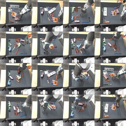
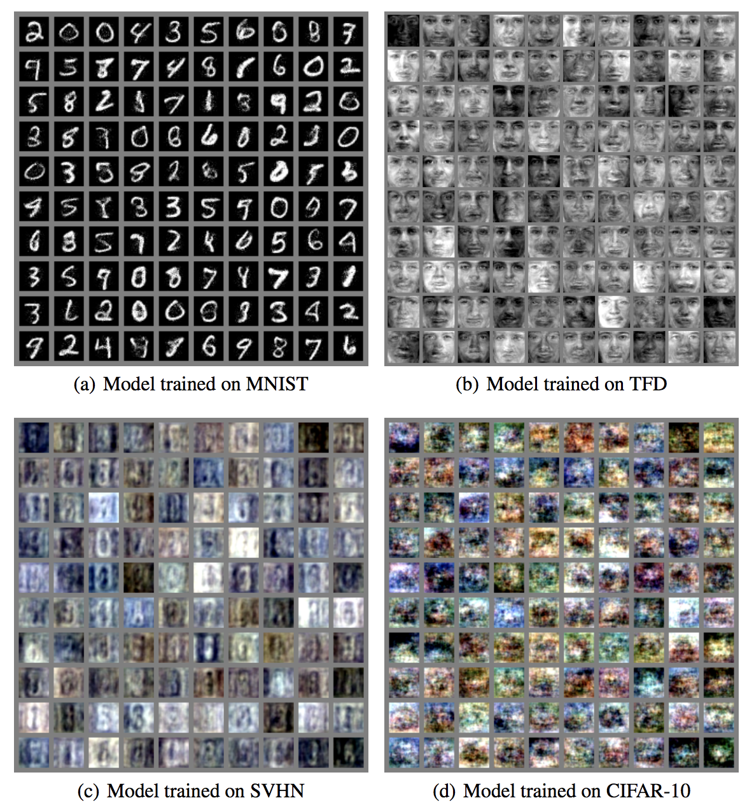
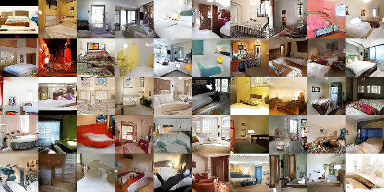

本节课将回顾各种模型的优缺点

### 1 课程总结

到目前为止，在课程中学习了以下模型与概念

- 自回归模型(Autoregressive models)
  - PixelRNN, PixelCNN, PixelCNN++, PixelSNAIL

- 流模型(Flow models)
  - NICE, RealNVP, Autoregressive Flows, Inverse Autoregressive Flows, Glow, Flow++

- 隐变量模型(Latent Variable models)
  - 使用变分下界逼近似然函数
  - Wake Sleep 
  - Variational Auto-Encoder, IWAE, IAF-VAE, PixelVAE (VLAE), VQ-VAE

- 隐含似然模型(Implicit models)
  - 生成对抗网络 (GAN)

  - 其他概念： 矩匹配(moment matching), 能量模型(energy based models)

- 自监督学习(Self-supervised Learning) / 表示学习(Representation Learning)
  - 从原始数据中学习对下游任务有帮助的、有意义的特征
  - 数据+计算+核心认知原则（常识任务、不变性先验[invariance priors]）。

### 2 自回归模型

#### 2.1 自回归模型回顾

- 2015年首先出现了MADE，在编码器中使用mask完成自回归过程的建模，并讲模型用于概率密度估计。

  

MADE 2015

- 在2016年，使用了更加大网络RNN/CNN构建自回归模型，出现了PixelRNN/CNN。这些模型可对更高维的向量进行建模，例如下图为64x64的ImageNet生成示例。

  

PixelRNN/CNN 2016

- 卷积也被用于处理1D的声音信号。为了建模声音中的远距离关系，采用了膨胀卷积(dilated convolution)。

WaveNet

- 带有mask的CNN自回归模型也被用于视频生成，结合LSTM以产生视频中连续的帧

Video Pixel Networks

- 随着时间的推移，自回归模型在模型结构与工程水平方面取得了不断的进展: 条件生成、分层自回归等。

Subscale Pixel Networks

Hierarchical Autoregressive Image Models with Auxiliary Decoders

- 以及OpenAI的语言模型GPT-2，句子、段落由前文生成后文。

#### 2.2 自回归模型取得巨大进展的原因

- 更大的batch size
- 更多的隐含单元、层
- 辅助变量的使用
- 数据预处理
- 计算能力的提升
- 训练时长的增加数天/周
- 更少的假设
- 模型结构进展
  - 掩膜卷积、因果卷积
  - 膨胀卷积
  - Transformers
- 损失函数
  - 依赖于优良的交叉熵损失

#### 2.3 自回归模型的未来发展方向

- 模型并行化；
- 对所有互联网文本进行训练的万亿级参数模型；
  - 这个已经出现了Google Switch Transformer  1.6万亿参数
- 文字与视频使用相同的模型。共享自注意力块，模型只包含编码器与解码器；
- 快速采样，新的模型具有稀疏性与高效性。例如用WaveRNN替代并行的Wavenet;
- 新的模型具有较弱的自回归结构，可以在更大尺寸输入数据上训练：
  - 模型应该综合考虑自回归结构与采样时间，这需要做出一些独立性假设，打破完全的自回归模型限制。

- 新的结构设计，例如对长距离关系建模的自注意力所引入的归纳偏置，这需要大量的计算资源。

#### 2.4 自回归模型的缺点

- 没有学习到特征表示层，无法直接用于下游任务；

- 目前在落地实用方面，**采样时间**还很长；

- 不可以差值，查看学习到了什么。

  

### 3 流模型

#### 3.1 流模型回顾

- 2014年出现了基于流模型的NICE，在CIFAR-10数据上生成结果还比较模糊；

NICE 2014

- 2016年RealNVP改善了模型结构，加入了BN层，极大地提升了生成结果的质量；

NICE 2016

- 随后是OpenAI提出的Glow模型

Glow

- 随后的Flow++ 以非自回归模型结构打到了自回归模型的似然函数结果

#### 3.2 流模型的未来

- 学习掩膜；
- 逼近与自回归模型在似然上的差距；
- 使用非常具有表达能力的一个flow或使用多个浅层flow然后叠加在一起；
- 使用多尺度损失函数- 权衡bits/dim与生成结果质量；
- 运用flow学习到的特征表示用于下游任务；
- 如何更好地初始化使得模型快速训练；
- 在Glow这种级别的模型上，探索使用更少的参数、生成更大的参数；
- 使用Flow降维；
- 设计带有条件的流模型；
- 总结：在与GAN/自回归模型对比生成结果质量/似然函数取值方面仍有很长的路要走。

#### 3.3 流模型的缺点

- 在flow模型中，因为层间转化的是概率的不同坐标系的取值，这要求隐藏层维度要与数据维度一致。在面对稍大尺寸数据时，导致了模型参数量偏大；
-  与上一点一致，模型没有低维嵌入层；
- 在面对不同领域任务时，参数需要小心初始化；

### 4 隐变量模型

#### 4.1 模型回顾

- 在深度学习中，隐变量模型的代表为2013年所提出的变分自编码器。在隐变量空间上差值(例：2D空间)，可生成如下数字图像：

Auto-Encoding Variational Bayes 2013

- 随后提出的扩展模型在其他数据集上也展现了不错的生成结果，例如2016年的PixelVAE，2019年结合分层设计的BIVA

PixelVAE 2016 

#### 4.2 VAE的应用

- Sketch-RNN草图插值/生成
- 世界模型 (world models)
- 强化学习中的视觉概念
- 生成查询网络(Generative Query Networks)
  - 可达成目的：输入几个角度的视角，模型可预测在某视角下看到的样子，如下图：

#### 4.3 VAE的优点

- 可对数据进行低维表征学习；
- 对似然的精确近似；
- 可插值生成结果，可了解模型学习到了什么；
- 解纠缠表征；
- VAE拥有以下特质：
  - 生成式模型
  - 密度模型
  - 隐变量模型
  - 可对数据降维

#### 4.4 VAE的缺点

- 生成结果模糊；
- 后验分布被假设为可分解的高斯分布(协方差为对角阵)，以及解码器假设太强；
- 生成更大规模结果(生成大尺寸图像)仍有待研究；
- 运用KL散度对解纠缠进行研究，目前仍处于研究简单示例的阶段；
- 也许还有更好的表示学习方法，或者能得到更好的样本，或者能得到更好的概率密度估计。

#### 4.5 VAE的未来

- 结合交叉熵损失函数或自回归类的解码器
- 使用形式更加多样的后验分布
- 将隐变量层次化地加入到模型中，控制生成结果的宏观特征与微观特征(*已有英伟达的 NVAE发表在2020NIPs上* )
- 使用离散化的隐变量防止“后验崩溃”，仍然可以使用PixelCNN类的解码器
- 在更大规模数据集上训练(与Glow那样)

### 5 生成对抗网络

#### 5.1 模型回顾

- 2014年Goodfellow提出GAN,当时的生成结果还比较模糊：

  

GAN 2014 

- 2015年将卷积神经网络引入GAN,提出了DCGAN

DCGAN 2015 

- 随后的StyleGAN , BigGAN等使用了更大规模(普通人玩不起)、更多稳定训练技巧的神经网络，产生了更好的生成结果：

StyleGAN

BigGAN

#### 5.2 GAN的未来

- GAN的发展方向：
  - 对于GAN所产生强有力的图片结果，很难预测GAN的未来
  - 更多关于无条件GAN的工作会出现
  - 未来生成任务变得更加复杂：更复杂的场景、更精准的细节、视频生成(考虑视频中物体的连续性)
- GAN模型结构搭建上的发展方向：
  - 关于Lipschitzness约束的新的实现方式；
  - 模型搭建调试技巧：随机噪声在不同尺度上输入模型、批归一化以及实例归一化
  - 模型设计：上采样、下采样、模型应该更深还是更宽；
  - 判别器的损失函数设计：铰链函数(Hinge Loss)...
  - 在更大规模数据上稳定训练(更少的参数+更大的批数据量)；
  - 噪声扰动层次化地加入到模型中(StyleGAN)，控制生成结果的宏观特征与微观特征

#### 5.3 GAN的缺点

-  需要太多的工程技巧与细节；
- 难以明确哪部分是核心内容，能够产生好的结果；
- 在大规模数据集上做消融实验是比较费时间的；
- 提升生成样本的多样性；

- 没有很好地评价标准；
- 消融实验/模型的核心内容/工程细节不仅仅是说GAN的。

#### 5.4 选择GAN还是密度模型

- 密度模型(基于数据的似然函数)有时也需要很多的工程技巧，例如FiLM conditioning, gating, LayerNorm, ActNorm；
- 即使仍缺少GAN背后的完整理论：滞后于经验实践与困难并不意味着不存在；
- 模糊/不存在的样本 vs 模式崩溃 ： 是选择多样性还是选择样本质量
- 除了能生成高质量样本外，GAN的流行还包括以下几点：
  - 计算代价并不大(1024x1024的百万级像素图片在V100 GPU上仅需要训练几个小时)；
  - 密度模型巨大，需要分布式的训练，产生合理的尖锐(对立于模糊)样本所需时间长；
  - 插值与条件生成被艺术家所采用。
- 历史上有着众多的发明与实践是早于解释他们的科学先出现的(来自Le Cun:Epistemology的ppt)

- 生成式模型家族(来自Goodfellow在NIPS上的讲座)

- 如果要训练密度模型，则应该考虑以下几点：
  - 若只考虑密度估计、不考虑采样，则应该选用自回归模型；
  - 若考虑采样，但采样效率要求不高，也可以用自回归模型。只用小模型、最好是RNNs或高效的卷积、自注意力块等；
  - 若很在意采样时间，则选用较弱的自回归模型，例如并行PixelCNN；
  - 流模型适用于建模连续随机变量的概率密度，在离散值上也开始出现好的研究；
  - 若需要对数据进行低维表征且考虑采样，或者只想使用一个最简单的模型，那么变分自编码器应是首要选择。

- 适用于使用GAN的场景:

  - 需要高质量的样本；

  - 面向大尺寸数据集时；

  - 条件生成；

  - 图像到图像的翻译模型(例如由草图生成完整图片的应用)；

  - 如果只关心采样质量、可控生成结果、不想要太多的计算量，则GAN应是首要选择。

    

### 6 自监督学习/表示学习

- 自监督学习在过去一年半中去的了飞速的发展，下图为自监督学习在ImageNet数据集分类任务Top-1准确率的SOTA发展进程。

#### 6.1 对比学习总结

- 先进的自监督学习模型以对比学习为基础，课程中关于对比学习总结如下：
  - 对比学习：可看作字典查找任务；
  - 有两种构建任务的方式：预测编码 和 实例区分；
  - 字典查找的两种机制: 端到端 和 动量编码器：
    - 预测编码的成功例子是CPC v2；
    - 实例区分的成功例子是：MoCo动量编码器和SimCLR 端到端实例对比。

#### 6.2 关于CPC v2

- 优点：
  - 空间预测和对比学习是通用的，可以适用于任何你还不知道基本不变量的模式或领域。原则上，可以用来训练一个潜伏空间生成模型。
  - 可用于训练视频、音频和文本，并进行多模态训练。
- 缺点：
  - 需要对原始数据进行切分，需要谨慎考虑切分块的大小、步长等；
  - 对切分后的数据进行训练，可能对下游任务起不到作用；
  - 很难运用批归一化(BatchNorm)；
  - 分割和处理机制在GEMM专用硬件（如TPU）上速度较慢。

#### 6.3 关于MoCo

- 优点：
  - 设计简约。使用和复制非常简单。
  - 不需要改变架构。可以轻松用于下游任务。
  - 对图像的不变性提炼很理想，让预训练看起来像监督学习。
  - 动量编码器增加了稳定性，并与SGD+动量一起工作。
  - Memory bank 将数据批次大小与负例数量解耦。
- 缺点：
  - 动量更新增加了衰减率的超参数。
  - 对数据增强的不变性可能不容易适用于其他模式，如文本、音频、视频。

#### 6.4 关于SimCLR

- 优点

  - 设计简约。使用和复制非常简单；
  - 不需要改变架构，可以轻松用于下游任务；
  - 对图像的不变性提炼很理想，让预训练看起来像监督学习；
    避免使用记忆库，因此从字面上看就像监督学习。

- 缺点

  - 足够的负例需要大量的数据批次大小，这又需要大量的计算(TPU)和跨计算设备的共享负例；

  - 对数据增强的不变性可能不容易适用于其他模式，如文本、音频、视频。

#### 6.5 自监督学习的未来

- 在同样的计算量、数据增强和训练时间下，完全缩小自监督和监督的差距。

- 对下游任务进行微调。相对于有监督的任务，只有少数任务能从自监督骨干中获益良多。除了分类之外，与下游任务相关性更强的目标可能是必要的。
- 即使不使用标签，仍然需要像ImageNet这样精心策划的数据集。自监督学习的理想梦想是在没有太多筛选的情况下，从真实世界或互联网的原始数据中学习。

 #### 6.6 自监督学习的现状

- 在缩小与Imagenet、Librispeech(CPCv2、MoCo、SimCLR、MoCo v2)上监督学习的差距方面取得了可喜的进展；

- 语言中的迁移学习，预训练语言模型(BERT, word2vec, fastText, ...)；

- 视觉中的迁移学习(CPCv2, MoCo, MoCo v2)；

- 在强化学习中接近于无；

- 主要希望建立与通用智能一样的概念--迁移学习、学习可重复使用的概念/抽象概念、建立计划和想象力、按图索骥等。

#### 6.7 主课结束

- 主要课程内容已经结束，在后面的几节课中将介绍无监督学习在各方面的应用；
- 本节课以Yann  LeCun所画的蛋糕结束！

