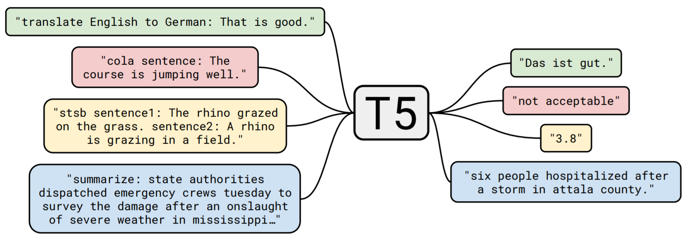
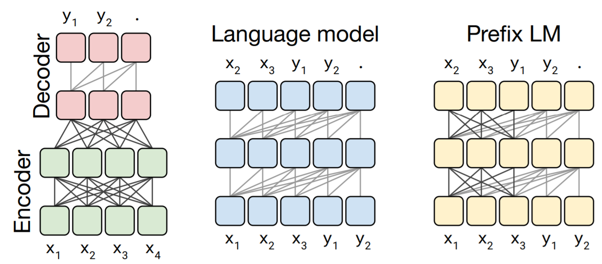

本节课是OpenAI的研究科学家[Alec Radford](https://arxiv.org/search/cs?searchtype=author&query=Radford%2C+A)所做讲座，他是GPT系列与DCGAN的作者。

### 1 文本学习

- 监督式学习需要“机器学习级”的数据，但是数据常常是不足的(当前的模型相较数据集已经过于庞大)
- 本讲座聚焦于几种从自然语言中学习的方法，以提高模型在标准NLP数据集/任务上的性能(主要面向预训练模型，以及后面做few-shot learning)。

- **核心方法**：基于自回归的极大似然类模型。

- 一些其他方法：

  - Word2Vec/Paragraph2Vec
  - Contrast Predictive Coding (CPC)
  - BERT

  - ELECTRA

    

### 2 动机与介绍

- 从拥有大量数据的互联网上学习。

#### 2.1 如何使用数据？

- 一个简单的方法是划定一片区间，计量词汇共同出现(co-occurrence)的次数。


- Combining Retrieval, Statistics, and Inference to Answer Elementary Science Questions 

  (Clark et al 2016)这篇文章中使用基于以上计数方法的**逐点互信息**PMI(*Pointwise* *mutual* *information*)作为评价标准去做下面的基础知识选择题。推测原理是利用大量文本学习选项词汇与题干词汇共同出现的次数。


- 正确率结果如下：

  

- 使用co-occurrence矩阵的问题：当词汇量比较大时，矩阵尺寸太大了。
  
  - 课程中举例是，1百万×1百万×4个字节=4TB
- 需要更为紧凑的方法表达词汇与信息之间的表示关系。

#### 2.2 词向量

- GLoVE (Pennington et al 2014)，为了解决共现矩阵过大的问题，这篇文章提出使用低维的向量来表示每个单词，并且让向量之间的內积作为两个词汇共同出现概率的log值。

  - 这样将原来$M\times M$矩阵($M$个单词)转化为了$M\times N$($N\ll M$)的词向量；

  - 训练使用损失函数为加权的平方误差函数：

    $J=\sum\limits_{i,j=1}^{V}f(X_{ij})(w_i^T\tilde{w}_j+b_i+\tilde{b}_j-\log X_{i,j})^2$

- 另外一种构建单词低维表征方法叫做Word2Vec，在前面的自监督课程中有介绍过相关内容。这是一种预测上下文的建模方法，可以通过上下文预测当前位置词语，也可以通过当前位置预测上下文词语。通过这种类似自编码器的结构，中间隐藏层即为单词的低维表示，如下图所示。

  


- 词向量对NLP任务的性能提升[McCann et al 2017]

  

- 词向量的位置与语义分析

  - 语义上相似的词汇在词向量空间中也是彼此靠近的；

  - 对应词汇的向量差值在语义空间中是类似的，例如不同国家对应各自的首都。

    

    

- 词向量的缺点：

  - 通过统计单词出现次数构成的词向量是远远不够的；

  - 语言出了字面意思外，还有很多引申义，词向量是无法描述这些顶层结构的；

  - 上下文对于词语的理解非常重要，只使用静态低维词向量是不行的。

    - 例如下面三句话中都包括bank，但是意思却都不一样。

      1.I went to the river bank.

      2.I made a withdrawal from the bank.

      3.“I wouldn’t bank on it”


### 3 语言模型介绍

- 70年发展历史[From Oriol Vinyals’ twitter]
  - SLP book, 2000 (Shannon, 1951), 3-gram模型
  - Sutskever et al, 2011, RNNs
  - Jozefowicz et al, 2016, BIG LSTMs
  - Liu et al, 2018, Transformer
  - Radford et al, 2019, BIG Transformer

#### 3.1 统计/概率语言模型

- 将语言解释为高维的离散概率分布。在已知一些语言样本时，计算字符串的概率

  **p(**“Is it going to rain today?”**)**

- 如何使用字符串的概率？
  - 语法上：**p(**The cat sat on the mat.**)** > **p(**The cat sats on the mat.**)** 
  - 世界知识：**p(**The hyena sat on the mat.**)** < **p(**The cat sat on the mat.**)** 
  - 语义分析：**p(**“1 star out of 5” | “That movie was terrible! I’d rate it”**)** 
  - 语音识别：修剪声学模型中可能的转录空间。著名的例子“wreck a nice beach” vs “recognize speech”
  - 机器翻译：重排翻译/直接集成在解码器中。

- 如何计算字符串的概率？

  - 首先是预处理，比如将英语字母都转化为小写；
  - 屏蔽低频词汇；
  - 将句子分成token；

- 处理字符串的方法：

  - 字符级别(丢弃非ascii码)；
  - 字节级别(使用UTF-8编码)；
  - Unicode编码；
  - 分词(Tokenized)、词汇级别预处理；

  - 字节对编码(Sennrich 2016)

- 几种计算字符串概率的模型：

  - 最简单的：假设1每个token概率相等，2且互相独立
    - $p(t_0)=1/vocab \; size$；$p(t_0, t_1, t_2, t_3) = product \;of \;p(t_i) \; \forall i$
  - **unigram**语言模型：打破假设1，将单词出现次数作为频次，然后归一化作为token的概率。
    - $p(t_0, t_1, t_2, t_3…) = p(t_0)p(t_1)p(t_2)p(t_3)...$
  - **bigram**语言模型：打破假设2，使用类似一阶马尔科夫链的形式，将两个词汇共同出现次数作为频次，然后归一化作为token的条件概率。
    - $p(t_0, t_1, t_2, t_3…) = p(t_0)p(t_1 | t_0)p(t_2 | t_1)p(t_3 | t_2)$
  - 混合模型
    - $p_{mixture}(t_1) = 0.01 * p_{uniform}(t_1)   +   0.99 * p_{unigram}(t_1)$

- 这种概率模型的缺点是如果遇到数据库中没有的词汇就无法处理。

- 80、90年代的语言模型研究多集中在如何更好地估计、平滑和插值n-gram语言模型上。下图是讲座中推荐的一篇综述。

  

#### 3.2 语言模型评估

- 因为语言数据库的庞大，处理的概率值一般是接近0的。概率值也是字符串长度的函数。
- 指标1：**最常用的评价指标是每个"token"负log概率的平均值。**
  - 字母级的似然模型使用以2为底的对数bits/char 或者 bits/byte；
  - 单词级的似然模型使用以e为底的对数，报道困惑度(perplexity)：$e^{-\frac{1}{N}\sum_i p_{w_i}}$

- 校准bits/char：
  - 这个评价指标是与数据集有关的；
  - 随机猜测值为$\log _2{1/256}=8 $ bpc
  - 目前人类值水平范围大约在$0.6-1.3$ bpc之间，现在性能好的模型能达到1bpc以下。

- 校准困惑度：

  - 随机猜测困惑度(PPL)为词汇量总数；
  - PPL可以理解为“语言的分支因子”，PPL的n次方为长度为n的字符串张成的空间；
  - 一个模型为下一个词语分配10个等概率可能性的词汇，则这个模型PPL为10；

  - 从BPC估计人类的PPL在5-10之间；
  - 如果在具体任务上考虑，例如翻译任务，最好的模型能达到3-4PPL

- 指标2：使用一些对下游任务有用的指标，例如

  - 语音识别中的WER；
  - 翻译任务中的BLEU；

  - 词性标注(pos tagging)中的F1分数；
  - 文档分类中的准确率ACC。


### 4 神经语言模型的历史

#### 4.1 `A Neural Probabilistic Language Model (Bengio et al. 2003)`

- 模型结构如下图：


- 这一个早期使用神经网络(多层感知机MLP)做语言模型的，在当时已经使用了远跳连接(skip connections)；
- 在计算设备上，当时使用的还是集群CPU，需要耗费几周甚至一个月来训练模型；

#### 4.2 `基于RNN的语言模型(Mikolov et al 2010)`


- 此工作使用RNN替换了MLP，使得模型感受野并不局限于局部的上下文；
- 在语音识别任务上提升了性能，如下图：


#### 4.3 `Generating Text with Recurrent Neural Networks (Sutskever et al 2011)`

- 字符级RNN；
- 对于每个输入字符使用不同的权重；
- 优化过程非常复杂。

#### 4.4 `Generating Sequences with Recurrent Neural Networks (Graves 2013)`


- 基于长短时记忆网络(LSTM)的字符级文本生成，LSTM单元结构如下图：


- LSTM中的一些公式：

  


#### 4.5 `Skip-Thought Vectors (Kiros et al 2015)`

- 真正对数据进行较完整地挖掘；

- 这篇文献中对句子进行序列建模，预测整句话的上下文；

  

- 在不同数据集上文本特征表示得分
  - 基于cBow的Word2Vec作为基线模型；
  - 对比模型包括一些双向模型(bi-skip)等。


- 模型提取语句特征降维(t-SNE)后的聚类效应

  


#### 4.6 半监督序列学习

- Semi-supervised Sequence Learning (Dai et al 2015) 这篇文章中将语言模型进行微调，用于下游任务。
  - 将语言模型作为预训练模型；
  - 用语言模型的权重初始化下游任务的权重；
  - 然后在下游任务上进行监督式训练。
- 文本分类结果如下


#### 4.7 探索语言模型的极限(2016)

- `Exploring The Limits of Language Modeling (Jozefowicz et al. 2016)`这篇文章出自谷歌，使用了大型模型与大数据集，来探索语言模型的性能上限。
  - 数据集包含10亿词汇(Chelba et al 2013)；
  - 模型为8k隐藏单元的投影LSTM (Sak et al 2014)；
  - 大型词汇表(800k)；
  - 训练使用32个K40 GPU 3周；
  - 困惑度由41下降到23.7。

- 以此文为引导，后续的ELMo模型才真正能够生成连贯的语句。


> 为什么要探索大模型在大数据集上的表现？

- 1）为了利用互联网上的海量数据，完美的模型应该在互联网数据作为输入时拟合模型参数；
- 2）小模型，例如字符级RNN只能关注字符间关系，无法对长序列建模；
- 3）模型参数量的增长存在规律性，是可预测的。例如


#### 4.8 Learning To Generate Reviews and Discovering Sentiment (Radford et al. 2017)

- 这是一篇本讲座的演讲者发表的文章。探索**数据量是否为模型性能的瓶颈**，此文中，使用40GB的评论文本作为训练数据；

- 模型使用4096个单元的LSTM在Pascal Titan X GPU上训练一个月；

- 模型最终欠拟合了；

- 模型以无监督的方式学习到了正面(下图绿色)、负面(下图红色)情感的评论。

  > 并不知道此处是怎么实现的。


#### 4.9 GPU Kernels for Block-Sparse Weights (Gray et al 2017)

- 后续此文探索**模型大小是否为性能瓶颈**。此模型使用具有18432个单元的LSTM网络；

- 相较于稠密网络，模型效率略高。模型对权重矩阵进行了稀疏画，如下图；
- 在情感分析上也有较好的表现。


> **情感分析使用预训练语言模型的性能表现**。


#### 4.10 Story Cloze Task: UW NLP System (Schwartz et al 2017)

- 此文所做工作为故事完结任务：给定“故事内容”，预测“故事结局”；

- 

- 不同模型性能对比(二分类准确率)：
  - 前两个是判别式模型，使用有监督训练。结果准确率与随机猜测(50%)相差不大。
- 


#### 4.11 The Sparsely-Gated Mixture-of-Experts Layer (Shazeer et al 2017)

- **此文探索模型总的参数量是否为性能瓶颈**，总参数量为1370亿；
- 模型结构如下，粉色块为LSTM，在蓝色框中使用了混合的专家网络结构。


#### 4.12 ELMo

- Deep contextualized word representations (Peters et al 2018) 此文将输入的词向量替换为双向语言模型的特征加权和，网络输出值代表**单词的上下文表示**(而不仅仅是考虑单个词的表示)；

- 模型结构如下图，输入为词向量，后接两次双向LSTM；

  

- 采用单词的上下文表示替换词向量后，可以使baseline模型(Jozefowicz et al. 2016)在各种任务上达到SOTA结果。


#### 4.13 Improving Language Understanding by Generative Pre-Training (GPT-1, 2018)

- GPT-1基于Transformer结构，试图在面对不同任务时，使用相同的模型结构。在面对新的任务时，只需要进行监督式的微调(例如Dai et al. 2015)即可；

- 模型结构：12个自注意力块，12头，768维词向量，约1亿参数量；

- 训练数据：5GB文本；

- 模型结构如下图：

  

- 不同任务上模型性能对比：

  


- 下图展示：
  - 1）在迁移学习时，从预训练语言模型迁移更多层时，性能更好；
  - 2）不同任务上的零样本学习表现，评价指标在随机猜测与当前SOTA之间归一化。


### 5 标准语言模型之后的故事

#### 5.1 当代NLP模型排行


- 其中第12位是人类水平。

#### 5.2 BERT

- BERT: Pre-training of Deep Bidirectional Transformers for Language Understanding (Devlin et al 2018) 与其他几个模型的区别对比：


- 对输入数据屏蔽掉一些词，然后进行预测(如前面课程中所讲的自监督学习一样)：

> Left-Right LM: The cat sat on the [mask] -> The cat sat on the mat
>
> Right-Left LM: [mask] cat sat on the mat -> The cat sat on the mat 
>
> Masked LM: The [mask] sat on the [mask] -> The cat sat on the mat

#### 5.3 RoBERTa

- RoBERTa: A Robustly Optimized BERT Pretraining Approach (Liu et al 2019) 为BERT在工程实现上更为精细调优的模型；
  - 优化了众多的超参数；
  - 删除了一些技巧(如上下文长度退火)；
  - 更好的数据生成(在线替换了缓存)；
  - 更灵活的词汇表方案；
  - 训练时间更长(原始BERT是欠拟合的)。

#### 5.4 ELECTRA (Clark et al 2019)

- ELECTRA模型结构如下图，在语言模型后端接了判别器以识别哪个token是未被mask的。


- 不同计算量下，模型性能表现对比：


- 更多对比结果：


#### 5.5 T5: Exploring the Limits of Transfer Learning with a Unified Text-to-Text Transformer (Raffel et al 2019)

- 此文为文本-文本的框架，执行任务也包含在输入文本中：



- 此文使用了以下三种模型：



- 对训练数据使用了不同的mask：


- 结果：


### 6 为什么需要无监督学习？

#### 6.1 监督式学习能到做多好？

- NLP推断数据集 SNLI (Bowman et al. 2015)，预测两句话之间的逻辑关联。
  - 矛盾(Contradiction)：-> A man inspects a uniform. A man is sleeping.
  - 不相关(Neutral) ：-> An older and younger man smiling. Two men are smiling at cats playing on the floor.
  - 蕴含(Entailment)：-> A soccer game with multiple males playing. Some men are playing a sport.

- 人类平均水平~88%，ESIM (Chen et al. 2017) 水平~ 88.0%


> Annotation Artifacts In Natural Language Inference Data (Gururangan et al. 2018)

- 这篇文章表明，在人工标注的数据集中从一些词汇就可以推断出句子的关系，例如：
  - not, never, nothing 暗示了`否定`；
  - person, animal, sport等通用词暗示了`蕴含`；
  - tall, sad, popular等修饰词暗示了不相关。
- 在一些比较难的样本上ESIM模型性能从88%下降到72%。

> Breaking NLI Systems with Sentences that Require Simple Lexical Inferences (Glockner et al. 2018)

- 这篇文章与上一篇类似，在人工构造的一些数据集上测试了ESIM模型性能；

- 构造测试集：

  - The man is holding a *{object}*.

    The man is holding a *{different object}*.

    **冲突**

  - A little girl is very *{adjective}*.

    A little girl is very *{synonym}*.

    **蕴含**

- 在新的8000样本测试集上，ESIM准确率为66%。

> Learning and Evaluating General Linguistic Intelligence (Yogatama et. al 2019) 

- 这篇文章探索了问答任务的SOTA模型BERT在不同分布的数据集上的表现(F1分数)；
- BERT在SQUAD上F1分数为86.5，但是在TriviaQA上得分35.6，在QuAC上得分56.2.

#### 6.2 什么地方错了？

- 标准的训练数据集可能不利于泛化；
- 模型在训练集中学习虚假关联；
- 模型学习了训练集的分布偏差；
- 模型训练误差一旦到了0就会 "停止学习"；
- 目前的技术是脆性的；
- 目前的技术更接近于记忆而不是泛化。

#### 6.3 如何推进？

- 更好的模型/架构？更多的数据？还是综合使用不同方法？
- 现代深度学习的完美故事应该是：
  - 将高水平域的知识编码在结构中；
  - 建立大型标注数据集；
  - 让SGD解决所有细节问题。

> 网络结构设计方面

- 在这方面有着很大的设计空间：
  - 在网络的某处乘以sigmoid；
  - 添加一个临时的最大池化层；
  - 在同一层使用三种不同尺度的卷积核；
  - 添加一些注意力机制。

- 常用的神经网络算子/结构设计为：
  - 卷积
  - 循环
  - 权重共享
  - 注意力
  - 分层
  - 深度
- 模型设计方面的例子：CoVe, ELMo, ULMFiT, GPT-1, BERT

> 扩大数据量方面

- 最大的监督式数据集JFT-300M(Sun et al. 2017)；
- 3亿张图片18000类别。

> 综合设计

- 使用高表达能力/灵活的模型处理不同的任务；

- 使用算法提取信息/学习模型结构；
- 使用大量的数据集(数十亿无标签数据)；
- 进行大量的计算。


#### 6.4 GPT-2

> 监督式模型、多任务模型、无监督模型对比

- 监督模型只在某个具体任务上性能较好，而在其他任务/数据集上泛化性差，如下图左；
- 多任务模型可以在多个任务上性能好，但是泛化性也不好，如下图中；
- 无监督模型则性能不要求特别高，但要求泛化性强于以上两者，如下图右。


- GPT-2训练使用40GB文本，100亿token，800万个网页；
- GPT-2使用更大的模型，15亿参数，1024token上下文长度，48层nn，1600词向量维度；
- GPT-2模型评估：

- 不同参数量下模型表现：

  


- GPT-2是如何学习的？需要执行的任务已经包含在数据集中了，例如有些文本内容为将一种语言翻译成另外一种语言(如下图)，模型可以自动学习到这种翻译能力。


- 训练数据中包含的有任务导向的内容统计：
  - 问答与阅读理解：数据中包括600万组问答
  - 总结：10万个TL，DR，In summary
  - 翻译：包含10MB法语数据
- 讲座中给出一幅图的对比，当数据量越大时，无监督模型的性能会大幅领先于监督模型。但是图上标注不清楚，大意为：横坐标是训练数据量，纵坐标是模型性能，底部红色线是监督模型性能，上面黄色紫色线为无监督模型性能，如下图。


#### 6.5 从大规模语言模型中得到的启示

- 往往一篇文章是解决不了模型性能的限制，需要整个行业研究者的共同推进；
- 当在一方面做得好时，另外一方面就会出现瓶颈：
  - 花里呼哨的模型->计算利用率，可训练性；
  - 参数量变大->计算能力跟不上；
  - 训练数据量变大->模型表征能力又会跟不上；
  - 模型表征能力变大->数据量和计算能力又会跟不上。

- 如何研究大规模模型：
  - 不要直接在大规模模型上做研究；
  - 先在缩小10倍、训练速度快10倍的模型上做实验探究，调整超参数、检查数据集等；
  - GPT-1就是零样本迁移学习的一个证明；并且它在WebText数据集的一些语言模型任务上已经达到SOTA水平；
  - 确认策略对小模型有效后，再往大模型上使用。讲座讲者在研究Sentiment Unit时，也是先使用512维LSTM训练几天，验证有效后再使用4096维LSTM训练一个月。

- 但是有些问题在小规模模型上显现不出来，在大模型上就能看出了。当模型性能没有像预期那样随着模型大小而增加时，就需要重新调整超参数。
  - 对于GPT-2来说，这种情况发生在自注意力块大于24时，模型出现了性能饱和，在解决问题时，使用了更好的参数初始化方法和预激活的残差网络。

#### 6.6 一些新的问题

- 自注意力架构+长序列=很多的内存；
- 重计算；
- 半精度(FP-16)；
- 数据并行。


- 写高效/优雅的代码
  - 原始的GPT-1在8个P6000上训练24天；
  - 优化后的模型在8个v100上训练3天，所做优化如下：
    - 1.75x from TF data parallel -> MPI + NCCL AllReduce
    - 1.50x from native TF ops -> Blocksparse ops
    - 3.50x from FP32 Pascal -> FP16 Volta
- 讲座讲者这里推荐Scott Gray等推出的神经网络计算加速库Blocksparse
  - 对于TensorFlow中一些基本操作的加速：
    - 归一化、优化器、激活函数等；
  - 自定义自注意力操作：
    - 避免转置、融合操作、稀疏计算等；
  - 针对Volta、Turing架构的硬件，TensorFlow允许相对上一代硬件3倍加速。
- 一些加速模块的导入：

```python
from blocksparse.transformer import BlocksparseTransformer, softmax_cross_entropy
from blocksparse.optimize    import AdamOptimizer, ClipGlobalNorm
from blocksparse.norms       import layer_norm
from blocksparse.embed       import embedding_lookup
from blocksparse.ewops       import bias_relu, dropout
from blocksparse.nccl        import allreduce
```


### 7 未来的方向在哪里？

- 在未来的几年里，语言模型将被训练在几乎整个互联网上（也可以把数以百万计的书扔进去！）。
- 缩放趋势是否会崩溃？
- 这将达到什么程度？
- 如果趋势线继续...

- 这可能会让人感到不满意，虽然GAN在模型不断变大时，生成了了越来越好的样本[Ian Goodfellow’s twitter]


