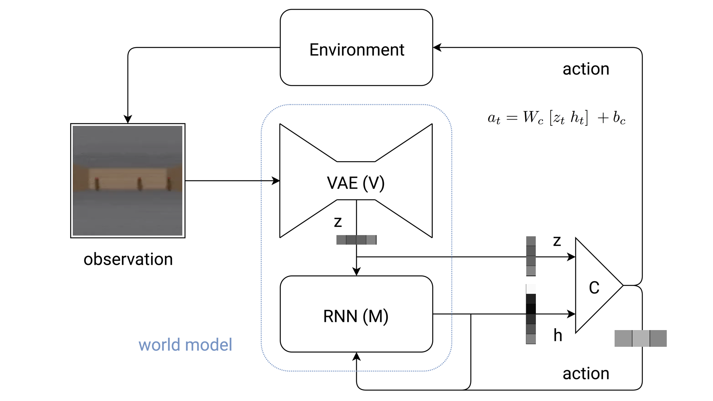
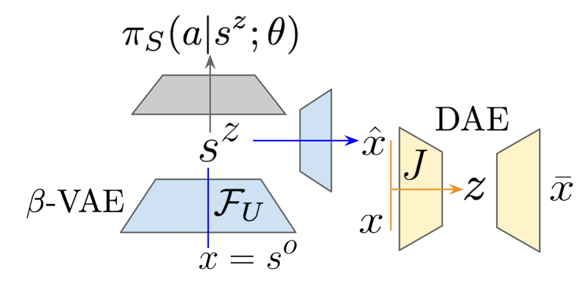
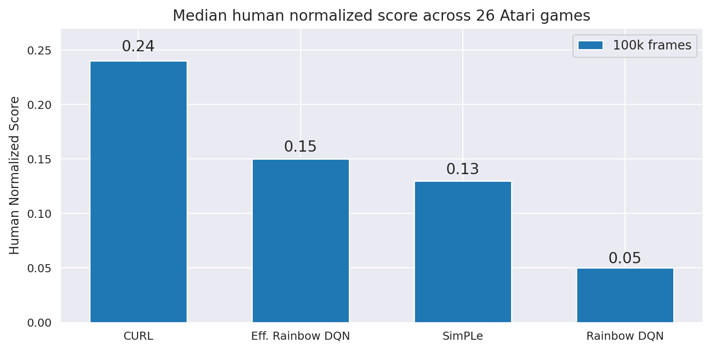

本节课将介绍无监督学习是如何与强化学习结合，并使得强化学习更加高效。

### 1.强化学习简介

#### 1.1 简介

- 强化学习是如下一种问题设定：
  - 智能体与环境交互；
  - 智能体给出动作(action)，当前状态(state)改变，并且环境给与一定的反馈(reward)，如上图所示([Image credit: Sutton and Barto 1998])；
  - 强化学习的目标：通过智能体不断地尝试，找出最佳的动作策略($\pi$)，能够最大化reward，使用公式表示即为$\max\limits_\theta \mathbb{E}[\sum\limits_{t=0}^H R(s_t)|\pi_\theta]$
  - 举例：比如在自动驾驶中，汽车的行驶控制为action；当前所处外部环境为state；能安全到达目标则reward高，反之出事故则reward低。
- 强化学习与监督式学习相比额外的难点：
  - 信用分配(Credit assignment)，举例：智能体不知道是自己的哪一步动作决定了最后的reward，比如厨师做了半小时饭，半小时后对饭的口味做出好或者不好的评价，厨师并不知道是哪一步影响了最后的结果。这需要多次的尝试才会有所改善；
  - 稳定性(Stability)，例如，使用强化学习去学习直升飞机飞行操控，可能会导致整个系统崩溃；
  - 探索(Exploration)，智能体需要不断的做出新的尝试，有时甚至不知道自己该尝试什么，这也给稳定性带来了挑战。

#### 1.2 成功案例

- 一些强化学习的成功案例，**DQN** Mnih et al, NIPS 2013 / Nature 2015

  **MCTS** Guo et al, NIPS 2014; **TRPO** Schulman, Levine, Moritz, Jordan, Abbeel, ICML 2015; **A3C** Mnih et al, ICML 2016; **Dueling DQN** Wang et al ICML 2016; **Double DQN** van Hasselt et al, AAAI 2016; **Prioritized Experience Replay** Schaul et al, ICLR 2016; **Bootstrapped DQN** Osband et al, 2016; **Q-Ensembles** Chen et al, 2017; **Rainbow** Hessel et al, 2017; **Accelerated** Stooke and Abbeel, 2018; … 

  这些算法实现了在Atari小游戏中的应用，随着相关算法的发展，游戏得分与训练速度都在不断的提升。

  

- 并且DeepMind还展示了强化学习在玩围棋方面的应用：
  - 第一版**AlphaGo** Silver et al, Nature 2015通过模仿学习与强化学习相结合；
  - 第二版**AlphaGoZero** Silver et al, Nature 2017则完全是强化学习通过自身的对抗演练学会玩围棋；
  - 后续的一些模型：**AlphaZero** Silver et al, 2017; Tian et al, 2016; Maddison et al, 2014; Clark et al, 2015

  

- 后续在大型游戏中的应用：

  - OpenAI在Dota 1v1 [2017]和 5v5 [2018,2019]；

    

- 课程中也展示了UCB自己在这方面的研究内容：
  - 机器人运动控制：让机器人学习如何行走，同样的代码不仅可以应用于2足机器人，还可应用于4足机器人**TRPO** Schulman, Levine, Moritz, Jordan, Abbeel, 2015 + **GAE** Schulman, Moritz, Levine, Jordan Abbeel, 2016

    

- 后来机器人学习了广泛的动作：

  - **DeepMimic**, Peng, Abbeel, Levine, van de Panne 2018

- 以及更加复杂繁琐的工作 **Guided Policy Search**, Levine*, Finn*, Darrell, Abbeel, 2016

#### 1.3 无监督学习与强化学习的结合

- 在强化学习中数据使用效率低下，智能体需要多次尝试才能展现优良性能，有什么方法能够减少智能体的尝试次数呢？
- 一些表示学习的技术可以应用于此，使得强化学习更加的高效：
  - 辅助损失(Auxiliary losses)；
  - 状态表示(State representation)；
  - 探索(Exploration);
  - 无监督技能发掘(Unsupervised skill discovery)。

### 2 辅助损失

- 课程中介绍的是来自DeepMind的论文Reinforcement Learning with Unsupervised Auxiliary Tasks

  - 深度强化学习所需的数据量比较大，尤其是当反馈(rewards)比较稀疏时；

  - 这篇文章通过引入额外的预测与控制任务，增强了智能体的学习效率；

  - UNREAL以A3C为基础模块，附加3个辅助任务，分别是：控制任务、奖励任务、价值函数回放，模型示意图如下：

    

  - UNREAL (Unsupervised REinforcement and Auxiliary Learning) 相比A3C (Asynchronous Advantage Actor-critic)在DeepMind的3D实验环境中，提升3倍数据利用效率与60%最终得分，结果如下：

    

  - 以及附带一些无监督学习对于模型的增强

    

  - 在DeepMind 3D平台的演示

    

  - 在另一个游戏中的表现

    

  - 在Atari游戏中的表现

  
  
- 鲁棒性：智能体的个体差异可能比较大
  
    

### 3 状态表示

#### 3.1 观测->状态

- 这里首先讲到的是名为“世界模型”的文章，通过VAE将高维观测降维为低维表示，然后将低维表示作为强化学习中智能体的输入；

  

- 此处使用RNN预测隐变量在下一个时刻的值；

  

- RNN的输出和隐变量都会影响智能体所做动作，整体系统框图如下：

  

- **举例：**CarRacing-v0 赛车游戏，训练流程

  - 1) 从随机策略中收集10000个样本；

  - 2) 训练VAE(V)编码帧为$z\in \mathcal{R}^{32}$；

  - 3) 训练MDN-RNN建模$P(z_{t+1}|a_t,z_t,h_t)$；

  - 4) 基于演化(evolution)训练线性控制器以最大化期望累计奖励。

  - 模型参数量统计：本例中强化学习模型参数只占少部分。

    

  - 模型结果对比：结合无监督学习的模型分数远高于纯强化学习模型。

    
  
- 课程中还列举了一些先关文献：

  - Junhuuk Oh, et al., Action-Conditional Video Prediction using Deep Networks in Atati Games (2015)
  - Blazej Osinski, et al., Model-Based Reinforcement Learning for Atari (2018)
  - Danijar Hafner, et al., Learning Latent Dynamics for Planning from Pixels (2018)

- 世界模型的demo: http://worldmodels.github.io 

#### 3.2 观测->状态+状态, 动作->下一个状态

- 上一小节介绍的是如何从观测到状态，然后构建模型在隐状态空间中学习。本小节介绍再附加上从观测+动作到下一个状态的建模；

- 这一小节的核心想法是将可能是非线性的动作通过神经网络投影到隐空间中，然后试图线性控制；

- 例如，如下图所示，假设问题为倒立摆，将目前观测输入到nn：

  - 一些相关的尝试：
  - [Lange et al.: Deep Learning of Visual Control Policies, 2010]
  - [Wahlstrerm et al.: From Pixels to Torques, 2015]

  

- 相关的情形还有以下几种：钟摆、车杆(倒立摆)、三连臂

  

#### 3.2.1 随机最优控制

- 此处介绍的第一种方法是隐空间中的随机最优控制(Stochastic optimal control, SOC)；

- 一个经典的例子是如下隐变量局部高斯、局部准线性动态系统；

  

  - 模型对输入状态(图像)进行嵌入学习(Embed to control, E2C)，通过VAE实现。将非线性的状态转化到线性变化的隐空间($\boldsymbol z$)

    
    
  - 并且最终$\boldsymbol z_{goal} $对应着的状态应是目标(车摆平稳不倒)
  
    
    
  - 其中每一步$z$转化时，满足如下线性高斯模型
  
    
    
    - 具体细节方面：相邻时刻转化关系对应的网络结构如下:
    
      $\bf x_t,x_{t+1}$为观测，$\bf u_t$为控制操作；这一步骤建模从($\bf x_t,u_t,x_{t+1}$到$\bf z_t,u_t,\hat z_{t+1}$)的关系，相邻的$z$由线性高斯模型$\mathbf {z}\sim\hat Q_\boldsymbol{\psi}(\hat Z|Z,\mathbf{u})$建模。
    
      
    
    - 总的损失函数如下：总体看上去即是两个VAE的损失合在一起。
    
      
    
  - 模型结果对比
  
    

- 此处课程中还介绍了一下授课者自己的工作

  SOLAR: Deep Structured Representations for Model-Based Reinforcement Learning

  内容基本上与上面介绍的嵌入学习一致，只是在不同时刻使用了不同的线性模型，模型框图如下

  

> *本小节剩余内容都是一些模型的粗略介绍。*

#### 3.2.2 空间自编码器

- Deep Spatial Autoencoders for Visuomotor Learning, Finn, Tan, Duan, Darrell, Levine, Abbeel, 2016 (https://arxiv.org/abs/1509.06113) 采用相同的策略，同样是将高维的状态输入通过**空间自编码**转化为低维的位置表示，然后在低维空间上使用 iLQR进行强化学习。

- 例如下图表示训练触手抓物体的模型结构，当最后的隐藏层不同位置被激活时，表示物理处在不同位置：

   

#### 3.2.3 自动的先验/PVEs

- PVEs: Position-Velocity Encoders for Unsupervised Learning of Structured State Representations
   Rico Jonschkowski, Roland Hafner, Jonathan Scholz, and Martin Riedmiller (https://arxiv.org/pdf/1705.09805.pdf)此文同样是训练一个编码器，但是在训练时，损失函数没有使用重构误差，而是使用一些物体的运动学特征，例如：位置，速度，加速度等。通过约束位置的差分为加速度、位置和速度不能突变、动作和状态的相关等作为损失函数，相关公式如下图所示：

  

#### 3.2.4 Darla

- Disentangled Representation Learning Agent (Darla), 

- DARLA: Improving Zero-Shot Transfer in Reinforcement Learning

  Irina Higgins, Arka Pal, Andrei A. Rusu, Loic Matthey, Christopher P Burgess, Alexander Pritzel, Matthew Botvinick, Charles Blundell, Alexander Lerchner (https://arxiv.org/abs/1707.08475)此文使用$\beta -VAE$对观测进行低维表征，得到观测的解纠缠表示(隐变量每一个维度表示输入观测的一种属性)，然后在隐变量上进行Q-Learning。

- 模型框图如下：

  

#### 3.2.5 因果infoGAN

- Learning Plannable Representations with Causal InfoGAN

  Thanard Kurutach, Aviv Tamar, Ge Yang, Stuart Russell, Pieter Abbeel (https://arxiv.org/pdf/1807.09341.pdf)此文使用infoGAN学习连续观测的生成，GAN的插值生成结果代表着在一种策略下连续的实验结果。

  

#### 3.2.6 PlaNet

- Learning latent dynamics for planning from pixels
   Danijar Hafner, T. Lillicrap, I Fischer, R Villegas, D Ha, H Lee, J Davidson (https://arxiv.org/pdf/1811.04551.pdf)
- 这篇文章大意为在学习观测的低维嵌入表示后，预测多步动作(对未来的计划)

#### 3.2.7 Dreamer

- 与PlaNet类似的模型是Dreamer: Learning actor-critic model on latent space，不去学习对未来几步的预测(计划)，而是学习一个actor-critic
- 动作模型$q_\phi(a_\tau|s_\tau)$，价值模型$v_\psi(s_\tau)$

- 如何使用学习到的动态模型训练actor-critic?
   - 使用动态模型生成想象的(动作)轨迹
   - 解释：基于动态模型的策略优化
- **Dreamer** [Hafner et al., 2020] Hafner, D., Lillicrap, T., Ba, J. and Norouzi, M., [Dream to Control: Learning Behaviors by Latent Imagination](https://arxiv.org/abs/1912.01603). In ICLR, 2020. 模型框图如下：

#### 3.2.8 视觉预测

- 上面介绍的几种模型都是在隐变量上执行强化学习，下面这个例子是直接在图像域中预测未来的帧；

- 模型结构如下：

  

- 此例应用场景为物体抓取，并移动到目标位置：

  

- Deep Visual Foresight for Planning Robot Motion, Finn and Levine, ICRA 2017 http://arxiv.org/abs/1610.00696

  Visual Foresight: Model-Based Deep Reinforcement Learning for Vision-Based Robotic Control, Frederik Ebert, Chelsea Finn, Sudeep Dasari, Annie Xie, Alex Lee, Sergey Levine, https://arxiv.org/abs/1812.00568, https://bair.berkeley.edu/blog/2018/11/30/visual-rl/

#### 3.2.9 正向-逆向动态模型

- Learning to Poke by Poking: Experiential Learning of Intuitive Physics, Pulkit Agrawal, Ashvin Nair, Pieter Abbeel, Jitendra Malik, Sergey Levine, https://arxiv.org/abs/1606.07419 此文提出：为了保证动态模型中的隐变量$z$是有意义的，不仅要学习当前状态到动作的预测(正向)，还要学习下一时刻状态到前一时刻采取的动作(逆向)。

- 模型结构如下：

  

#### 3.3 观测->状态 + 状态，动作->下一个动作，未来反馈

> 前面几个小节都没有关注反馈/回报(reward)，本小节关注与强化学习中的重要指标--reward

- The Predictron: End-To-End Learning and Planning, David Silver, Hado van Hasselt, Matteo Hessel, Tom Schaul, Arthur Guez, Tim Harley, Gabriel Dulac-Arnold, David Reichert, Neil Rabinowitz, Andre Barreto, Thomas Degris (https://arxiv.org/pdf/1612.08810.pdf)

- 依次预测每一步的reward

  

  

- 改进版：Successor Features for Transfer in Reinforcement Learning, André Barreto, Will Dabney, Rémi Munos, Jonathan J. Hunt, Tom Schaul, Hado van Hasselt, David Silver (https://arxiv.org/abs/1606.05312)

- 考虑当每一步的reward都有好几部分组成时的情况

  

- Composable Action-Conditioned Predictors: Flexible Off-Policy Learning for Robot Navigation 

  Gregory Kahn*, Adam Villaflor*, Pieter Abbeel, Sergey Levine, CoRL 2018 (https://arxiv.org/pdf/1810.07167.pdf)

  Self-supervised Deep Reinforcement Learning with Generalized Computation Graphs for Robot Navigation 

  Gregory Kahn, Adam Villaflor, Bosen Ding, Pieter Abbeel, Sergey Levine, ICRA 2018 (https://arxiv.org/pdf/1709.10489.pdf)

  课程中·在此处列举了一些授课者自己的工作。使用CNN结合LSTM，从状态与动作预测未来观测的特征，模型框图如下：

  

- 实时预测方向、速度、是否会发生碰撞等：

  

#### 3.4 最优表示吗？

- 一些关于状态表示的基础理论：

  ■From skills to symbols: Learning symbolic representations for abstract high-level planning: https://jair.org/index.php/jair/article/view/11175

  ■Homomorphism: https://www.cse.iitm.ac.in/~ravi/papers/KBCS04.pdf

  ■Towards a unified theory of state abstraction for mdps: https://pdfs.semanticscholar.org/ca9a/2d326b9de48c095a6cb5912e1990d2c5ab46.pdf

  ■ Model reduction techniques for computing approximately optimal solutions for markov decision processes.https://arxiv.org/abs/1302.1533

  ■Adaptive aggregation methods for infinite horizon dynamic programming

  ■Transfer via soft homomorphisms. [http://www.ifaamas.org/Proceedings/aamas09/pdf/01_Full%20Papers/12_67_FP_0798.pdf](http://www.ifaamas.org/Proceedings/aamas09/pdf/01_Full Papers/12_67_FP_0798.pdf)

  ■Near optimal behavior via approximate state abstraction https://arxiv.org/abs/1701.04113

  ■Using PCA to Efficiently Represent State Spaces: http://irll.eecs.wsu.edu/wp-content/papercite-data/pdf/2015icml-curran.pdf

- 经典控制理论中的分离原理：能够分别设计状态的估计器和控制器，以达到一个比较优的结果。

#### 3.5 "端到端"：学习一种对计划有益的表示

- 上面介绍的几种模型是动态模型结合强化学习智能体或计划者(planer)，现在要介绍的是一种“端到端”风格的方法，即在学习动态模型时提取对后面进行强化学习有益的特征。例如上面曾介绍过的嵌入学习(Embed to control, E2C)提取的特征，直接使用线性控制模型即可。那如果是更一般的控制器/计划者呢？要如何进行表示学习？

- 课程中在此处介绍的是讲者参与的一篇NIPS2016最佳论文 Value Iteration Networks, Aviv Tamar, Yi Wu, Garrett Thomas, Sergey Levine, Pieter Abbeel, NeurIPS2016, https://arxiv.org/abs/1602.02867

- 此论文将规划能力视为衡量表示学习性能的标准，所以引入了一个规划模块辅助神经网络做出决策。具体可参考介绍这篇论文的相关博文。

- 价值迭代网络(VIN)结构:

  

- 通用规划网络：

  

  嵌入梯度下降轨迹优化的通用(以目标为条件的)策略参数化；

  优点：泛化性强(归纳偏差)；在抽象空间中学习到了一种评价标准。

- 对比方法：

  - 模仿学习学不到以目标为导向的规划能力，所以泛化性要差一些。

  

  - 横轴为训练次数，纵轴为平均测试成功率。

  

#### 3.6 CURL

- 此处先列举了基于像素和基于状态的强化学习训练速度/数据利用效率对比：[Tassa et al., 2018] Tassa, Y., Doron, Y., Muldal, A., Erez, T., Li, Y., Casas, D.D.L., Budden, D., Abdolmaleki, A., Merel, J., Lefrancq, A. and Lillicrap, T [DeepMind Control Suite](https://arxiv.org/abs/1801.00690), arxiv:1801.00690, 2018.

  - 绿色线基于图像像素作为输入比基于状态的方法需要多训练5000万步才能达到相同水平。

  

- 为了提高数据利用效率，在强化学习中也引入了自监督对比学习。此处先回顾了自监督/对比学习在计算机视觉方面的模型，也就是前几课中介绍的CPC/SimCLR/MoCo等模型。

- 接下来介绍的模型为[Srinivas\*, Laskin\*  et al. 2020] *equal contribution, CURL: Contrastive Unsupervised Representations for Reinforcement Learning, Aravind Srinivas*, Michael Laskin*, Pieter Abbeel https://arxiv.org/abs/2004.04136 即将强化学习和对比学习结合起来，模型结构如下：

  - 从重播缓冲区(Replay buffer)中去除几个相邻的帧作为观测，经过数据增强，上面分支进行强化学习，下面分支结合上下输出的特征进行对比学习。

  

- 此处对比学习的损失使用的是带权重的双线性內积作为评价指标：

  

  - 使用双线性內积损失与余弦相似度损失在执行强化学习时的对比：

  

- 此处在进行对比学习时，作者也引入了MoCo中的动量编码器，并作了对比：

  

  

- 基于像素的CURL和基于状态的其他模型对比：可达到相当水平。

  

- 以及在多种任务上的对比：红色线为基于像素的CURL，灰色线为基于状态的模型：

  - 其中在有的任务两者已经接近，有的任务上CURL还有所差距。

  

  - 更详细的数值对比

    

- Atari游戏中的对比：

  

- Atari游戏数值对比

  

- 基于像素的强化学习能达到人类对数据有效利用的水平吗？

  - 在Atari游戏中的对比：9种游戏中只有2种强化学习算法得分接近了人类水平。

    

### 4 探索

#### 4.1 探索奖励

- 当访问以前没有经常访问的状态时，给予探索奖励

  - 但是：对于大的/连续的状态空间不切实际
  - 状态的相似性很重要，而不仅仅是单个状态。

- 探索奖励(1)

  - Count-Based Exploration with Neural Density Models, Georg Ostrovski, Marc G. Bellemare, Aaron van den Oord, Remi Munos, https://arxiv.org/abs/1703.01310

    使用PixelCNN对游戏图像进行密度估计；对低概率密度游戏场景(非常见状态)进行探索时，给与奖励。

- 探索奖励(2)

  - Exploration: A Study of Count-Based Exploration for Deep Reinforcement Learning, 
     Haoran Tang, Rein Houthooft, Davis Foote, Adam Stooke, Xi Chen, Yan Duan, John Schulman, Filip De Turck, Pieter Abbeel (https://arxiv.org/abs/1611.04717)

    使用VAE学习嵌入表示，然后将特征投影到hash表中进行计数，对于探索效率很有帮助。

- 探索奖励(3)

  - VIME: Variational Information Maximizing Exploration, Rein Houthooft, Xi Chen, Yan Duan, John Schulman, Filip De Turck, Pieter Abbeel (https://arxiv.org/abs/1605.09674)

    此文使用了贝叶斯神经网络动态模型，基于预测后验与更新后的模型后验分布之间的KL散度给与奖励。当KL散度较大时，说明此时产生了一些值得学习的新东西。

- 探索奖励(4)

  - 将好奇心引入到探索中：Curiosity-driven Exploration by Self-supervised Prediction, Deepak Pathak, Pulkit Agrawal, Alexei A. Efros, Trevor Darrell (https://arxiv.org/abs/1705.05363)

    Large-Scale Study of Curiosity-Driven Learning, Yuri Burda, Harri Edwards, Deepak Pathak, Amos Storkey, Trevor Darrell, Alexei A. Efros (https://arxiv.org/abs/1808.04355)

#### 4.2 通过目标生成来探索

- GoalGAN
  - Automatic Goal Generation for Reinforcement Learning Agents, Carlos Florensa, David Held, Xinyang Geng, Pieter Abbeel (https://arxiv.org/abs/1705.06366)
  - 通过不断生成更好的目标来实现训练，基于GAN不断生成质量更好的样本来实现。
- RIG
  
  - Visual Reinforcement Learning with Imagined Goals, Ashvin Nair, Vitchyr Pong, Murtaza Dalal, Shikhar Bahl, Steven Lin, Sergey Levine (https://arxiv.org/abs/1807.04742)
  - 学习概率隐变量模型(VAE)；
  - 对于状态和目标表示使用隐表示；
  - 对于后知后觉的经验重标记生成目标；
  - 为了探索生成目标；
  - 进行奖励时，使用潜在空间距离。
  
  

#### 4.4 通过技巧转移来探索

- 在强化学习中使用表示学习时，一般的想法是关注如何学习观测的一种表示，便于进行强化学习与建模。例如：

  - Embed2Control [Watter et al]

  - Deep Predictive Policy Training [Ghadirzadeh et al]

  - DARLA [Higgins et al]

  - Robotic Priors [Jonschkowski and Brock]

  - UPN [Aravind, Allan, Chelsea, etc]

  - Causal InfoGAN [Kurutach, Tamar et al]

- 这种方法尤其是在试图以像素作为输入、有复杂观测时比较有用。

> 除了对观测的低维表征外，我们还能学习其他表示吗？例如：轨迹、行为、任务。

- 探索通常在动作空间和参数空间具有随机性，课程中介绍下图后一种：在参数上设置随机性要好一些。

  

- 如何利用先验经验进行探索呢？

- 能否在一个更好的空间中添加噪声，而不是在动作/参数空间添加噪声呢？

  如果我们学习一个表示输入任务分布行为的潜在空间呢？ 即我们能否学习一个行为的生成模型，并使用它来生成新的探索性行为：

  

  

- 方案1：Hausman et al 2018

  - 针对许多任务进行训练(每个任务以d为索引)。将不同任务的探索都投影到标准正态分布上。

  - Learning an Embedding Space for Transferrable Skill, Hausman, Springenberg, Wang, Heess, Riedmiller, ICLR 2018

  - $\pi_\theta$-策略，$a_t$-动作，$s_t$-$t$时刻状态，$d$-任务索引，$\tau$代表轨迹，MI-互信息

    

- 方案2：Gupta et al 2018

  - 经过一次在参数$\theta, \mu, \sigma$上的策略梯度更新，我们得到了良好的行为。

    

  - Model-Agnostic Exploration with Structured Noise (MAESN), Gupta, Mendonca, Liu, Abbeel, Levine, 2018

  - 在三个任务(wheeled locomotion, legged locomotion, block manipulation)上表现的广阔的探索空间

    
    
    

### 5 无监督技能发掘

- 这里介绍的是与上一小节相似的模型，结合使用了不同的目标函数

  

- SSN4HRL (Florensa, Duan, Abbeel, 2016)

  $MI(d;\tau)$

- Variational Intrinsic Control (Gregor et al 2016)

  $MI(z;s_H)$

- Diversity is all you need (Eysenbach et al 2018)

  $\sum\limits_t MI(z;s_t)$

- VALOR (Achiam et al 2018)

  $MI(z;\tau)$

### 6 本节课总结

- 本节课比其他讲座讲的都要简略，只介绍表示学习是如何应用于强化学习的。
  - 1）辅助损失：引入与任务相关的辅助损失有助于快速训练强化学习模型，例如：UNREAL。
  - 2）状态表示：接下来介绍的是当面对高维图片进行输入时，需要借助于表示学习抽取输入图像的低维表示/低维状态，当学习的低维表示与真实状态相接近或匹配时，学习速度会快很多，例如：CURL以像素作为输入的方式可以与以状态作为输入的学习方式达到相同的学习速度。
  - 3）探索：设置探索奖励对未进行过的动作进行尝试有助于强化学习的训练。因为在高维空间中总是会进行不一样的尝试，需要衡量这些尝试之间的相似度，这时使用了生成模型对概率密度进行估计。此外还可以使用生成模型对行为进行生成，而不是随机的探索一些动作。以及使用生成模型进行目标生成，生成一些新的目标让强化学习智能体去实现，提升它们的能力。
  - 4）无监督技能发掘：这是本节课最后介绍的一点内容。在预训练阶段没有任何奖励，但仍希望智能体可以表现出一些有趣的行为，这样可以在遇到新的任务/关注新的奖励时使用可重用的技能。

### 7 推荐文献

> 本节课未涉及到的表示学习与强化学习相结合的文献

■**Temporal Difference Variational Auto-Encoder**
 Karol Gregor, George Papamakarios, Frederic Besse, Lars Buesing, Theophane Weber
 https://arxiv.org/abs/1806.03107

■**Model-Based Reinforcement Learning for Atari**
 Lukasz Kaiser, Mohammad Babaeizadeh, Piotr Milos, Blazej Osinski, Roy H Campbell, Konrad Czechowski, Dumitru Erhan, Chelsea Finn, Piotr Kozakowski, Sergey Levine, Ryan Sepassi, George Tucker, Henryk Michalewski
 https://arxiv.org/abs/1903.00374

■**Time-Contrastive Networks: Self-Supervised Learning from Video**
 Pierre Sermanet, Corey Lynch, Yevgen Chebotar, Jasmine Hsu, Eric Jang, Stefan Schaal, Sergey Levine
 https://arxiv.org/abs/1704.06888

■**Learning Actionable Representations with Goal-Conditioned Policies
** Dibya Ghosh, Abhishek Gupta, Sergey Levine
 https://arxiv.org/abs/1811.07819

■**Deep Object-Centric Representations for Generalizable Robot Learning**
 Coline Devin, Pieter Abbeel, Trevor Darrell, Sergey Levine
 https://arxiv.org/abs/1708.04225

■**Decoupling Dynamics and Reward for Transfer Learning
** Amy Zhang, Harsh Satija, Joelle Pineau
 https://arxiv.org/abs/1804.10689

