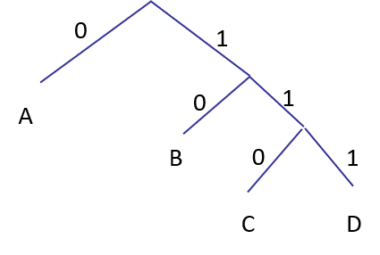
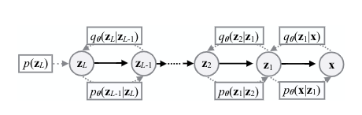

### 1 压缩

#### 1.1 基本概念

- 定义：降低信息(图像、语音、音乐)编码位数

  

- 研究压缩的目的：

  - 在传输与存储数据时，节省时间、带宽、空间；
  - AI角度：对数据的压缩能力也体现着对数据理解了多少(更好的生成模型对应着更好的压缩性能)。

- 分类：

  - 有损压缩(lossy)和无损压缩(lossless compression);
  - 本节课专注于无损压缩。

- 课程推荐的参考文献

  > Introduction to Data Compression, Guy E. Blelloch
  >  https://www.cs.cmu.edu/~guyb/realworld/compression.pdf

#### 1.2 应用

- 通用的文件压缩
  - 文件：gzip, bzip, 7z
  - 档案：PLZIP
  - 文件系统：NTFS, HFS+, ZFS

- 多媒体
  - GIF, JPEG
  - MP3
  - MPEG, DivX, HDTV
- 通信
  - Fax
  - Modem
  - SKype

### 2 符号编码

#### 2.1 固定长度编码

- ASCII码：将键盘上的符号编码为固定长度7位值。

  - 优点：编码解码方便；
  - 缺点：没有进行信息压缩，字符--编码仅仅是一一对应关系。

  

#### 2.2 可变长度编码

- 如何避免歧义：

  - 不存在某一字符的编码是另外一个字符编码的前缀(前缀码)。

  - 在每个字符编码后都添加结束符号，例如莫尔斯编码 (Morse)

    - 在Morse中，常用的字母A/E/I，使用较短的位进行编码；
    - 且在传输过程中，使用不同长度的空位表示一个单词和字母的结束。
    - Morse 编码是非前缀码，例如，A的编码是J的编码的前缀。

    

- 前缀码：Binary Tries

  - 类似二叉树的结构，从根到叶子节点，每个路径编码一个字符。

#### 2.3 霍夫曼编码

- 最优前缀码：Huffman
- 算法过程：
  - 1）计算待编码序列每个字符$i$出现的概率$p[i]$；
  - 2）将最低的两个出现概率的字符连接/合并，视为一个字符，并且加和概率；
  - 3）重复第2）步，直到整个树结构形成。

- 算法举例

  - 如下图，首先将CF合并，再合并B、E，此时这四个字符出现概率和为0.39；
  - 然后合并剩余两个出现概率小于0.39的字符(A、D)
  - 最后将两个分支合并。

  

  

- 生成模型用于此，估计字符概率密度。**有正确的概率密度，才有最优的编码**。

- Huffman编码应用：

  

### 3 理论极限

#### 3.1 香农熵

- Shannon: 熵 (Entropy)是信息的度量。

  $H(X)=\sum\limits_i p(x_i)\log_2 \frac{1}{p(x_i)}$

- 熵计算方式，如下频率直方图

- 熵编码(Entropy coding)
  - 设置编码长度 $l_i=\lceil \log_2 \frac{1}{p(x_i)}\rceil$
  - 例如，$(A,0.5),(B,0.25),(C,0.125),(D,0.125)$

#### 3.2 Kraft-McMillan 不等式

- Part I. 对于任意可唯一解码的编码C，有

  $$\sum\limits_{(s,w)\in C}2^{l(w)}\leq 1$$

​       其中$l(w)$是字符$(s)$的编码($w$)最小长度

- Part II. 反过来也成立，对于一系列的长度$\boldsymbol{L}$，如果

  $\sum\limits_{l\in L}2^{-l}\leq1$

  则存在一种前缀码C，编码长度为$l(w_i)=l_i,i=1,\dots,|\boldsymbol{L}|$

- Part I.证明(简要证明特殊情况): 仅考虑前缀码。假设编码长度为

  $l_1\leq l_2\leq \cdots\leq l_n$

  - 有这样的关系：前缀码 $\rightarrow$ 编码为叶子节点$\rightarrow$ 最长的编码长度为树的深度$l_n$；
  - 假设树最深为$l_n=4$层(如下图)，每个红点包含叶子数最大为 $2^{l_n-l_i}$；
  - 显然$\sum\limits_{i}2^{l_n-l_i}\leq 2^{l_n}$，则$\sum\limits_{i}2^{-l_i}\leq 1$。

- Part II. 证明(简要)：
  - 假设：$l_1\leq l_2\leq \cdots\leq l_n$ ，树最大深度为$l_n=4$层(如上图)；
  - 当把第$i$个变量$l_i$放入树中第$l_i$层时，其下仍有$2^{l_n-l_i}$个叶子是可用的；
  - 如果已知$\sum\limits_{i}2^{-l_i}\leq 1$，则$\sum\limits_{i}2^{l_n-l_i}\leq 2^{l_n}$，树中有足够空间放下所有的叶子。

#### 3.3 Huffman编码

#### 3.3.1 香农定理

- 香农定理 (Shannon Theorem, 1948)：使用唯一可解码的编码C，传输任意服从分布$P(X)$的信息所用平均编码长度将大于信息的熵

  $H(X)\leq l_a(C)$

- 证明：

  $\begin{align}H(X)-l_a(C)&=\sum_i p(x_i)\log_2\frac{1}{p(x_i)}-\sum_ip(x_i)l_i\\ &=\sum_i p(x_i)(\log_2\frac{1}{p(x_i)}-l_i)\\&=\sum_i p(x_i)(\log_2\frac{1}{p(x_i)}-\log_22^{l_i})\\&=\sum_i p(x_i) \log_2 \frac{2^{-l_i}}{p(x_i)}\\&\leq \log_2(\sum_i2^{-l_i})\\&\leq\log_2(1)\\&=0\end{align}$

#### 3.3.2 最优前缀码

- 前缀码编码长度可能是$l_i=\lceil \log_2\frac{1}{p(x_i)}\rceil$吗？

- 可能，其满足上述K-M不等式。

  

  

- 那么现在期望编码总长度是多少？

  

- Huffman编码是最优前缀码，证明：
  - 通过数学归纳法证明。
  - 1) 假设出现概率最低的量子符号是x和y；
  - 2) 最优前缀编码在最低的等级上有2个叶子节点；
  - 3) 不失一般性，假设x和y拥有相同的出现概率；
  - 4) 当考虑将概率最小的两个字符融合为一个时，假设此时为最优前缀码，则添加x与y后是以最小代价添加的，这时Huffman编码仍为最优。

- 小节回顾：

  - **定理**：[Shannon 1948] 如果数据源是0阶马尔科夫模型$P(X) $，平均编码长度($bits$)大于信息的熵.

  - **定理**：[Huffman 1952] 如果数据源是0阶马尔科夫模型$P(X)$，霍夫曼(Huffman)编码的平均编码长度小于等于信息的熵+1 ($\leq H(X)+1$).

    

### 4 编码注意点

#### 4.1 当实际字符概率为$p$，编码时使用概率为$\hat{p}$会怎样？

- 当使用概率$\hat{p}$编码时，编码长度的期望为

- 使用错误的概率$\hat{p}$进行编码，所花费的额外代价是${p}$与$\hat{p}$之间的KL散度。

#### 4.2 高阶模型

- 如果数据的熵很高会怎样？熵高意味着长的编码长度。

- 考虑条件概率分布$P(X|C)$降低熵：

  $H(X|C)=\sum\limits_c p(c)\sum\limits_xp(x|c)\log_2\frac{1}{p(x|c)}$

- 条件熵(Conditional entropy) 低于熵：

  $H(X|C)\leq H(X)=\sum\limits_c p(c)\sum\limits_x p(x|c)\log_2\frac{1}{p(x)}$

- 当给定一些条件C后，再预测X要比较容易，X的熵降低了。这正是自回归模型所做的。

#### 4.3 +1

- 重复上一小节**定理**：[Huffman 1952] 如果数据源是0阶马尔科夫模型$P(X)$，霍夫曼(Huffman)编码的平均编码长度小于等于信息的熵+1 ($\leq H(X)+1$).
  - 假设熵很低时，例如$P(X)=[0.9,0.05,0.05]\rightarrow H(X)=0.569$
  - 使用最优编码[0,11,10]，则平均编码长度为0.9+0.1+0.1=1.1 为熵的两倍
  - 一次考虑传送一个字符时，平均编码长度约为熵的两倍，代价较大。可改为一次传输多个字符，情况会有所改善，例如一次发送 AAC, ABC, AAB等。

- 行程长度压缩 (Run Length Encoding) 即是一次发送多个字符。例如，如下图传真。

- 英语语言的熵
  - 香农通过给定上文，预测正确下文单词所用次数的概率分布，计算英语字母的熵。

- - 英语字母的不同编码方式对应位数

### 5 自回归模型与算数编码

#### 5.1 算数编码

- 动机：算数编码(Arithmetic Coding) 试图组合多个符号进行编码，以避免每个字符单独编码时，位数"+1"的缺点。(与上文所述行程长度压缩类似)
- 核心思想：通过索引编码成分布式。
  - 无需决定使用多少符号或哪些符号；
  - 通过数据流工作；
  - 适合使用自回归模型。

- 例子：

  - 假设$P(a)=0.8,P(b)=0.2$，现要编码“aaba”

  - 每个字符单独编码成本较高，算数编码将以上序列编码为区间[0.512,0.6144]，如下图

  - 字符串"aaba"依次对应着区间缩短比例(概率)[0.8,0.8,0.2,0.8]

  - 

  - 如何对区间进行编码：

    - 一个简单的尝试：将区间编码为其内部包含最少位的数；
    - 例如，想要编码区间[0,0.33],[0.33,0.67],[0.67,1] ，我们会将区间编码为二进制的0.01 (1/4), 0.1(1/2), 0.11 (3/4)；
    - 对于一个长度为$s$的区间，至多需要$\lceil-\log_2 s\rceil$位进行编码；
    - 这种编码是非前缀码。

  - 使用完整的二进制编码例如，0.00 [0,0.25], 0.100 [0.5,0.625], 0.11 [0.75,1]。

  - 对于长度为$s$的区间，编码长度为$\lceil-\log_2 s\rceil$

    编码长度$\leq H(X)+2$ [+1来自四舍五入，+1来自于“+1”]

  - 存在问题：

    - 1）编码区间跨越0.5，在传输没有完成之前，这种情况不能发送第一个比特；
    - 解决方法：将信息分成若干块；
    - 2）假设无限精确；
    - 解决方案：整数实现(见Blelloch 2013)。

- 自回归模型用于算数编码
  - 使用概率的链式法则对字符进行建模
  - 

### 6 VAE, Bits-Back Coding, Asymmetric Numeral Systems (ANS)

- 本节参考文献

- -Brendan J. Frey and Geoffrey E. Hinton, *“Efficient Stochastic Source Coding and an Application to a Bayesian Network Source Model,”* The Computer Journal 1997

  

  -James Townsend, Thomas Bird, David Barber, “*Practical lossless compression with latent variables using **bits back coding**,”* ICLR 2019

  

  -Friso Kingma, Pieter Abbeel, Jonathan Ho, *“Bit-Swap: Practical Bits Back Coding with Hierarchical Latent Variables,”* ICML 2019

  

  -Jarek Duda, *“**Asymmetric numeral systems**: entropy coding combining speed of Huffman coding with compression rate of arithmetic coding,”* 2007

  

  -GE Hinton, D Van Camp, *"Keeping Neural Networks Simple by Minimizing the Description Length of the Weights"*, 1993

- 回顾编码

  - 熵=使用$ \log_2\frac{1}{p(x_i)} $ $bits$编码符号时，期望编码长度。

    $H(X)=\sum\limits_i p(x_i)\log_2 \frac{1}{p(x_i)}$

  - **定理**：[Shannon 1948] 如果数据源是0阶马尔科夫模型$P(X) $，平均编码长度($bits$)大于信息的熵.

  - **定理**：[Huffman 1952] 如果数据源是0阶马尔科夫模型$P(X)$，霍夫曼(Huffman)编码的平均编码长度小于等于信息的熵+1 ($\leq H(X)+1$).

  - 算数编码(AC)：编码一批信号，整体额外成本+2

- 关键假设
  - 如前文所述，服从分布$p(x)$的样本被以下方式编码
    - Huffman：对每个样本穷举编码；
    - AC ：对每个样本编码到区间上。
  - 以上两种编码方式在推广时，存在问题：
    - 只能在小型数据集上穷举编码；
    - 当样本$x$是连续值时，如何编码？
    - 当样本$x$是高维数据时，如何编码？
  - 主要观点
    - 一些高维数据仍可被传统编码方式编码；
    - 简单的高维分布可使用表达能力更强的混合模型进行编码。

#### 6.1 连续$x$

- 一个连续的实数$x$拥有无限的信息量，不可能被精确编码，例如无理数。

  - 以精度$t$对$x$进行离散截断处理；
  - 或者可将$x$映射到概率分布 pdf或cdf

- 微分熵，离散化后变量的熵(左下的$t$不知道哪去了)：

  $\begin{aligned}
  H\left(x_{\mathrm{disc}, \mathrm{t}}\right) &=-\sum_{i} t p\left(x_{i}\right) \log \left(t p\left(x_{i}\right)\right) \\
  &=-\sum_{i} t p\left(x_{i}\right) \log p\left(x_{i}\right)-\sum_{i} t p\left(x_{i}\right) \log t \\
  & \approx-\int_{x} p(x) \log p(x) d x-\log t \int_{x} p(x) d x \\
  &=h(x)-\log t
  \end{aligned}$

  与直觉一致，在直方图中横轴间隔$t$越小，条形柱越多，信息量越大。

- 离散化后仍可食用Huffman或AC进行编码。

#### 6.2 混合模型

- 当数据服从一些特殊高维分布时，仍可使用简单的编码方案：
  - 例如，标准正态分布$\mathcal{N}(0,I)$可视为$n$个独立的随机变量(协方差为对角阵)；
  - 例如，变量服从自回归模型。
  
- 当数据服从复杂分布时，应用混合模型对其进行编码。因为GMM模型远胜于单一的高斯。

- 混合模型$P(x)=\sum\limits_i p(i)p(x|i)$，假设$p(x|i)$是比较容易编码的。

- 编码方式1 (Max-Mode) ：

  - 1）首先找到待编码样本$x$对应的$i$，使得$p(i|x)$最大化的$i$，(因为$x$是固定的，所以同时也最大化了$p(i,x)$)；

  - 2）传送$i$---成本$\log 1/p(i)$；

  - 3）传送$x$---成本$\log 1/p(x|i)$。

  - 平均编码长度

    

  - 这种编码方式是最优的吗？不是。因为使用了分情况编码(分布Q)来近似了真正的多模态(分布P)，在替换分布时会产生额外的分布之间差距成本(KL散度)

- 编码方式2 (Posterior-Sampling)

  - 1）从$p(i|x)$中采样；

  - 2）传送$i$---成本$\log 1/p(i)$；

  - 3）传送$x$---成本$\log 1/p(x|i)$。

  - 平均编码长度

    $l_a(C)=\sum\limits_{i,x}\log\frac{1}{p(i,x)}$

  - 这种编码方式发送了$(i,x)$，但是原本只是想发送$x$，仍有冗余。

#### 6.3 Bits-Back Coding

- 编码方式3 (Bits-Back Coding)
  - 在编码方式2的基础上，重构对$p(i|x)$采样时的随机位，这部分发送成本是$\log1/p(i|x)$。这部分可不算在传输成本中，反而作为补偿；
  - 总成本$\log1/p(i)+\log 1/p(x|i)-\log 1/p(i|x)=\log1/p(x)$；
  - 这样就达到了最优情况。

- Bits-Back Coding如上图所示，其中辅助变量(随机位)由额外的渠道传输。
- 与近似推断相结合
  - 接收解码$i,x$，附加额外的提议分布$q(i|x)$替换$p(i|x)$；

  - 重构对$q(i|x)$进行采样的随机位；

  - 这些随机位也要发送，成本为$\log 1/q(i|x)$，不计入总成本；

  - 总成本为：$\log1/p(i)+\log 1/p(x|i)-\log 1/q(i|x)=ELBO$正是VAE中的变分下界。

  - Bits-Back Coding编码流程：(下图中$y=i,s=x$)

    大致意思是，先前对数据的编码可做为编码后面数据时，选择模态$q(i|x)$的随机种子。所以这部分可以从总成本中减去。

    

- Bits-Back Coding发展历程

  - Wallace, 1990; Hinton & van Camp, 1993
    - Bits-back idea

  - Frey & Hinton, 1996
    - Bits-back implementation with arithmetic coding; but not very natural fit

  - Duda, 2009
    - Asymmetric Numeral Systems (ANS) coding

  - Townsend, Bird & Barber, ICLR 2019
    - Bits Back with ANS (BB-ANS)

  - F. Kingma, Abbeel & Ho, ICML 2019; Ho, Lohn, Abbeel, NeurIPS 2019
    - Bit Swap
    - Local Bits Back Coding

#### 6.4 ANS

- 非对称数字系统(Asymmetric Numeral Systems)，课程中举了一个简单的例子来说明ANS的核心思想与做法。

  - 假设要编码$a,b$，其出现概率各为0.5；
  - 初始状态$s=0$，如果要编码$a$则$\text{enc}(s,a)=2s$，如果要编码$b$则$\text{enc}(s,b)=2s+1$，然后依次编码；
  - 对于这种简单的情况，解码时，先看最后一位如果状态$s$是偶数则可知最后一位原始数据为$a$，反之则为$b$，然后依次向前解码。总体为堆栈结构(先进后出)。

- 一个稍微一般些的例子：

  - 假设要编码$a,b$，其出现概率分别为1/4，3/4；
  - 则使用能被4整除的自然数(集合$S_a=\{0,4,8,\dots\}$)代表$a$，剩下数字(集合$S_b=\{1,2,3,5,6,7,\dots\}$)代表$b$；
  - 初始状态$s=0$，编码规则为：
    - 编码$a$时，$\text{enc}(s,a)=S_a中第s^{th}个数$；
    - 编码$b$时，$\text{enc}(s,b)=S_b中第s^{th}个数$；
  - 例如当编码“$b,a,b$”，编码过程依次为$\text{enc}(0,b)=1$，$\text{enc}(1,a)=4$，$\text{enc}(4,b)=6$.

- ANS编码结果为

  - $x_T\approx \frac{x_0}{p(s_1)p(s_2)p(s_3)\cdots p(s_T)}$

  - 当以2进制编码时，编码长度为 （下式第二项为熵，说明此编码方式接近最优编码）

    $\log x_T\approx C+\sum\limits_t\log \frac{1}{p(s_t)}$

#### 6.5 BB-ANS

- BB-ANS结合 Bits-Back 、 ANS、以及隐变量模型，可编码更加复杂的数据(图像等)；

- 数据服从混合模型分布$p(\mathbf{x})=\sum\limits_{\mathbf{z}}{p(\mathbf{x}|\mathbf{z})p(\mathbf{z})}$

- 编码过程：

  - 1）从数据流中解码$\mathbf{z}\sim q(\mathbf{z|x})$；
  - 2）使用$p(\mathbf{x|z})$编码$\mathbf{x}$；
  - 3）使用$p(\mathbf{z})$编码$\mathbf{z}$。
  - 平均编码长度$\mathbb{E}_{\mathbf{z}\sim q(\mathbf{z|x})}[\log q(\mathbf{z|x})-\log p(\mathbf{x,z})]$

- 编解码过程如下图：

  

- **注意点1**：在与VAE结合时，会将连续隐变量$z$以精度$\delta z$离散化。在平均编码长度中将关于$z$的PDF换为PMF，

  $-\mathbb{E}_{Q(z_i|x)}[ \log \frac{p(x|z_i)p(z_i)\delta z}{q(z_i|x)\delta z} ]$

  其中消掉$\delta_z$，成本仅是连续分布与离散分布之间的KL散度[Hinton & van Camp, 1993]。

- **注意点2**：在数据流中$z$足够具有随机性吗？

  - 编码时使用的$z$是之前数据点编码结果，不是完全具有随机性；
  - $z$被$p(z)$编码，被$q(z|x)$解码，存在分布之间的距离误差$\text{KL}(q(z)||p(z))$；
  - 这个额外的成本是VAE损失函数中的一项，但在实际优化时，这一项并不会完全到零。

- 编码性能

  - 编码结果显示编码位数与VAE的ELBO接近。

  

#### 6.6   Bit-Swap

- 由以上结果可知，编码位数的缩短与VAE的目标函数相关。所以使用具有多个隐变量的VAE应该会具有更高的ELBO，更低的编码位数。

- 多隐变量VAE

  

- 当隐变量有多个时$z_{1:L}$，有两种编码方式：
  - 1）将$z_{1:L}$看作是一个大的隐变量，直接应用**BB-ANS**进行编码；
  - 2）**Bit-Swap**：在$z_1$上应用BB-ANS，然后依次在$z_2,z_3,\dots$上编码。

- 两种编码算法伪代码

  

- 面对数据流时，两种编码方式的编解码过程

  1）BB-ANS

  

  - 2）Bit-Swap

    

- Bit-Swap性能

  

### 7 基于流模型的压缩

- 回想一下，流模型是将已知简单分布逐步转化为数据集服从的分布。其似然函数如下

  $-\log p(\mathbf{x})=-\log p(\mathbf{z})-\log |\det \mathbf{J}(\mathbf{x})|$

#### 7.1 模型构建 

- 同样需考虑以精度$\delta_x$离散化数据空间。
  - 将数据空间中小立方体体积记为$\delta_x$，包含$x$的小立方体记为$B(x)$
  - 概率质量函数(PMF)为$P(\mathbf{\bar x}):=\int_{B(\mathbf{\bar x})}p(\mathbf{ x})d\mathbf{ x}$，则$-\log P(\mathbf{\bar x})\approx -\log p(\mathbf{\bar x})\delta_x$
  - 期望编码长度：$-\log p(\mathbf{\bar x})\delta_x=-\log p(f(\mathbf{\bar x}))-\log |\det \mathbf{J}(\mathbf{\bar x})|-\log \delta_x$
- 到此，还不能直接运用编码算法，因为变量是高维的，不能用传统编码方式；流模型的一端为随机分布，不能直接按照流模型优化。

- 接下来，将以VAE的形式构建编解码模型。
  - 假设条件概率分布为：
    - $\tilde{p}(\mathbf{z} | \mathbf{x} ):=\mathcal{N}(\mathbf{z};f(\bf x),\sigma^2\bf J(\bf x)\bf J(\bf x)^\rm T)$
    - $\tilde{p}( \mathbf{x}| \mathbf{z}):=\mathcal{N}(\mathbf{x};f^{-1}(\bf z),\sigma^2\bf I)$
    - 
    - 因为局部的转化是雅克比行列式的作用，所以在第一式中，使用了雅克比乘雅克比的转置作为了协方差。

- 编码算法顺序：
  - 1）解码$\bf \bar z\sim \mathcal{N}(f(\bar x),\sigma^2 J(\bar x)J(\bar x)^\rm T)\delta_z$
  - 2）编码$\bf x \sim \mathcal{N}(f^{-1}(\bar z),\sigma^2 I)\delta_x$
  - 3）编码$\bf z \sim p(\bar z)\delta_z$

- 编码长度 $ \mathbb{E}_\mathbf{z} L(\mathbf{x,z})=-\log  p(\mathbf{x})\delta_x+O(\sigma^2)$

- 这样做后VAE的ELBO就与流模型的似然建立了联系

#### 7.2 原始方法的缺点与改进

- **问题1**：如上问所述，其中要处理雅克比行列式，其时间复杂度为$O(d^3)$，空间复杂度为$O(d^2 )$。虽然是多项式时间内可解的，但对于处理高维数据还不够好。
- 解决方法：使用一些特殊模型构造技巧。
  - 自回归流：变量按照维度依次编码，无需雅克比行列式，线性时间可解；
  - 模型构造：一层一层编码，类似Bit-Swap；
  - RealNVP家族：无需雅克比；线性时间；可并行。

- **问题2**：如上文所述，编码长度为$-\log P(\mathbf{\bar x})-\log p(\mathbf{\bar x})\delta_x$，对于高精度数据，编码位数段。但不适合低精度数据。

- 解决方法：引入额外的高精度位，并且使用bits-back方式降低传输成本。

  $\begin{array}{c}
  P(\mathbf{x}):=\int_{[0,1)^{d}} p(\mathbf{x}+\mathbf{u}) d \mathbf{u} \\
  \mathbb{E}_{\mathbf{u} \sim q(\mathbf{u} \mid \mathbf{x})}\left[-\log \frac{p(\mathbf{x}+\mathbf{u})}{q(\mathbf{u} \mid \mathbf{x})}\right] \geq-\log \int_{[0,1)^{d}} p(\mathbf{x}+\mathbf{u}) d \mathbf{u}=-\log P(\mathbf{x})
  \end{array}$

  编码长度结果为去量化变分下界(参考Flow++)。

- 运用Flow++中的去量化，RealNVP类的模型编码结果如下图

  

- 但是这种编码方式需要的辅助位太多了，远高于VAE类模型的编码方式。即使只编码一幅图片，甚至需要50bits/dim。且流模型的编码方式需要计算高精度的雅克比行列式。

  

### 8 Lempel Ziv压缩算法

- 上文所述的压缩模型可以分为以下几类

  - 1）**静态模型**：对于不同数据集的内容都使用相同的编码方式，例如ASCII，Morse编码；
  - 2）**动态模型**：基于生成模型的编码算法。这种方法需要先训练一个生成模型，然后传输这个模型。
  - 3）**自适应模型**：在线学习并更新模型。特点：更加精确的建模，解码需要从头开始。例如LZW。

- LZ算法做法：在编码当前位置时，向前面位置看，找到之前字符是否有和当前位置字符重复的，只记下重复位置即可。

  

- LZ77的原理（粗略）
  - 对于各态遍历的源，回顾过去看到$x$的平均时间$T$为$1/p(x)$；
  - 整数$T$可被近似编码为$\log (T)$位；
  - 所以长时间来看，每个字符被编码为$\mathbb E [\log (1/p(x))]$，即是最优编码。

### 9 一些新的进展

- Townsend et al. HiLLoC: lossless image compression with hierarchical latent variable models (ICLR 2020)

  - 使用全卷积神经网络结合隐变量模型，来对大尺寸图像进行压缩。

- Havasi et al. Minimal Random Code Learning (ICLR 2019)

  - 替换了bits-back coding

  - 编码器采样$K=2KL(q||p)$个 样本$ z1:K ~ p(z)$, 然后发送一个从1到$K$的随机数来编码一个特定的$z$。

  - 解码器使用相同的随机数发生器来恢复样本$ z$

  - 这是$q$中的低偏差样本，取$log K=KL(q | | p)$位对$z$进行编码。这实现了无bits-back的bits-back码长。

- Yang et al. Feedback Recurrent Autoencoder (2019)

  - 编解码结构的有损压缩模型；

  - 随着时间的推移，编码器模拟解码器，以便为将来提供更多的信息位，从而减小编码长度。