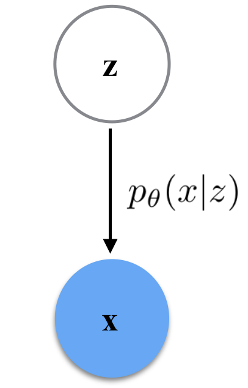
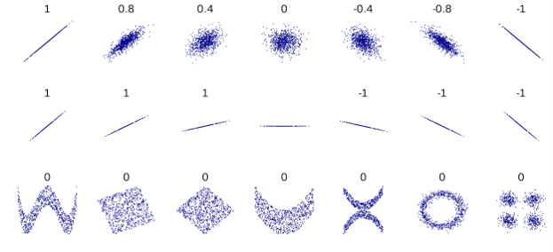

### 1 动机

#### 1.1 隐变量模型

- 前几节所讲模型(自回归、流模型等)所建模描述的变量都是可观测的
- 隐变量模型中部分变量不可观测，
  - 例1：高斯混合模型(GMM)中某个样本是来自哪个高斯分布是未知的
  - 例2：高维数据的低维表示(下图中狗的品种、颜色、形状等的量化值)

#### 1.2 为什么需要隐变量模型

- 探索高采样效率的模型(相比自回归模型)
- 探索数据产生过程的原理

#### 1.3 隐变量模型中的任务

- **表示**：假设概率图模型如下

  

  $z,x|z$服从伯努利分布$\begin{aligned}
  z&=\left(z_{1}, z_{2}, \cdots, z_{K}\right) \sim p(z ; \beta)=\prod_{k=1}^{K} \beta_{k}^{z_{k}}\left(1-\beta_{k}\right)^{1-z_{k}} \\
  x&=\left(x_{1}, x_{2}, \cdots, x_{L}\right) \sim p_{\theta}(x \mid z) \Leftrightarrow \text { Bernoulli }\left(x_{i} ; \operatorname{DNN}(z)\right)
  \end{aligned}$

- **采样**：$\begin{aligned}
  z & \sim p_{Z}(z) \\
  x & \sim p_{\theta}(x \mid z)
  \end{aligned}$

- **评估**：$p_{\theta}(x)=\sum_{z} p_{Z}(z) p_{\theta}(x \mid z)$
- **训练**：MLE   $\max _{\theta} \sum_{i} \log p_{\theta}\left(x^{(i)}\right)=\sum_{i} \log \sum_{z} p_{Z}(z) p_{\theta}\left(x^{(i)} \mid z\right)$
- **推断**：隐变量的表示$x\rightarrow z$

### 2 隐变量模型的训练

### 2.1 目标函数

- 精确的似然函数: $z$是离散的几个值时

  - 例：拟合3高斯混合模型，将z先验地认为是均匀分布

    $p_{Z}(z=A)=p_{Z}(z=B)=p_{Z}(z=C)=\frac{1}{3}$

    - 确定$z$后，生成数据的条件高斯分布为：

    $p_{\theta}(x \mid z=k)=\frac{1}{(2 \pi)^{\frac{n}{2}}\left|\Sigma_{k}\right|^{\frac{1}{2}}} \exp \left(-\frac{1}{2}\left(x-\mu_{k}\right)^{\top} \Sigma_{k}^{-1}\left(x-\mu_{k}\right)\right)$

    - 则可计算$x$的概率值, 引出似然函数进行优化

    $p_{\theta}(x)=\sum_{z} p_{Z}(z) p_{\theta}(x \mid z)$

    - 数据如左图，优化后采样生成样本如右图

    

            
            
    

- 近似似然1: 当$z$值较多时

  - 从$z$的先验分布中采样计算似然函数：

    $\sum_{i} \log \sum_{z} p_{Z}(z) p_{\theta}\left(x^{(i)} \mid z\right) \approx \sum_{i} \log \frac{1}{K} \sum_{k=1}^{K} p_{\theta}\left(x^{(i)} \mid z_{k}^{(i)}\right)$

    其中$z_{k}^{(i)} \sim p_{Z}(z)$

  - 缺点：采样$z$太过于随机，导致生成$x$的条件概率分布$p_{\theta}(x^{(i)} \mid z_{k}^{(i)})$值接近于0 (例如在GMM中,当$z$与$x$不对应时)，导致梯度消失。当$z$是高维变量时，这点尤为显著。

- 近似似然2：重要性采样(Importance Sampling)

  - 针对直接从先验$p_{Z}(z)$中采样的困难，引入另外一个较容易的提议分布$q$, 从中采样

  $\sum_{i} \log \sum_{z} p_{Z}(z) p_{\theta}\left(x^{(i)} \mid z\right) \approx \sum_{i} \log \frac{1}{K} \sum_{k=1}^{K} \frac{p_{Z}\left(z_{k}^{(i)}\right)}{q\left(z_{k}^{(i)}\right)} p_{\theta}\left(x^{(i)} \mid z_{k}^{(i)}\right) \quad \text { with } z_{k}^{(i)} \sim q\left(z_{k}^{(i)}\right)$

  - 不妨取$q$为$z$的后验分布$p_{\theta}\left(z \mid x^{(i)}\right)=\frac{p_{\theta}\left(x^{(i)} \mid z\right) p_{Z}(z)}{p_{\theta}\left(x^{(i)}\right)}$
  - 假设$q$为参数化的概率分布,通过最小化KL散度，使得$q$逼近$p_{\theta}\left(z \mid x^{(i)}\right)$

$\begin{aligned}
&\quad\min _{q(z)} \operatorname{KL}\left(q(z) \| p_{\theta}\left(z \mid x^{(i)}\right)\right. \\
&=\min _{q(z)} \mathbb{E}_{z \sim q(z)} \log \left(\frac{q(z)}{p_{\theta}\left(z \mid x^{(i)}\right)}\right) \\
&=\min _{q(z)} \mathbb{E}_{z \sim q(z)} \log \left(\frac{q(z)}{p_{\theta}\left(x^{(i)} \mid z\right) p_{Z}(z) / p_{\theta}\left(x^{(i)}\right)}\right)\\
&=\min _{q(z)} \mathbb{E}_{z \sim q(z)}\left[\log q(z)-\log p_{Z}(z)-\log p_{\theta}\left(x^{(i)} \mid z\right)\right]+\log p_{\theta}\left(x^{(i)}\right)\\
&=\min _{q(z)} \mathbb{E}_{z \sim q(z)}\left[\log q(z)-\log p_{Z}(z)-\log p_{\theta}\left(x^{(i)} \mid z\right)\right]+\text { constant independent of } z
\end{aligned}$

- - 上式推断是在每个样本$x^{(i)}$上进行的，实际上优化时可以将每个数据样本上的后验分布视为同样参数的后验(称为Amortized Inference)

  - Amortized Inference

    - 目标函数 $\min\limits_{\phi} \sum\limits_{i} \mathrm{KL}\left(q_{\phi}\left(z \mid x^{(i)}\right) \| p_{\theta}\left(z \mid x^{(i)}\right)\right)$
    - 生成与推断：
    - 

    - 后验分布重参数化：(有助于降低梯度方差)

      $q_{\phi}(z \mid x)=\mathcal{N}\left(\mu_{\phi}(x), \sigma_{\phi}^{2}(x)\right)$ 等价于 $z=\mu_{\phi}(x)+\varepsilon \sigma_{\phi}(x)$

      其中 $\varepsilon \sim \mathcal{N}(0, I)$

- Importance Weighted AutoEncoder (IWAE)

  目标函数1：$\max\limits_\theta\sum_{i} \log \frac{1}{K} \sum_{k=1}^{K} \frac{p_{Z}\left(z_{k}^{(i)}\right)}{q\left(z_{k}^{(i)}\right)} p_{\theta}\left(x^{(i)} \mid z_{k}^{(i)}\right) \quad \text { with } \left.z_{k}^{(i)} \sim q\left(z_{k}^{(i)}\right)\right)$

  目标函数2：$\min\limits_{\phi} \sum\limits_{i} \mathrm{KL}\left(q_{\phi}\left(z \mid x^{(i)}\right) \| p_{\theta}\left(z \mid x^{(i)}\right)\right)$

  $k$越大对似然的近似越好

- 变分下界/证据下界 (ELBO)

  - 推导1 (Jensen) ：利用log为凹函数的性质

  $\begin{align}&~~~~\max\limits_{\theta}\sum\limits_i\log p_\theta(x^{(i)})\\&=\max\limits_{\theta}\sum\limits_i\log[\sum\limits_z p_Z(z)p_{\theta}\left(x^{(i)} \mid z \right)]\\&=\max\limits_{\theta}\sum\limits_i\log[\sum\limits_z \frac{q(z)}{q(z)}p_Z(z)p_{\theta}\left(x^{(i)} \mid z \right)]\\&\geq\max\limits_{\theta}\sum\limits_i \mathbb{E}[\log p(z)-\log q(z\mid x^{(i)})+\log p_\theta(x^{(i)}\mid z)] ~(ELBO)\end{align} $

  - 推导2 (KL) : $\begin{aligned} D_{\mathrm{KL}}\left[q_{x}(z) \| p(z \mid x)\right] &=\mathbb{E}_{z \sim q_{x}(z)}\left[\log q_{x}(z)-\log p(z \mid x)\right] \\ &=\mathbb{E}_{z \sim q_{x}(z)}\left[\log q_{x}(z)-\log \frac{p(z, x)}{p(x)}\right] \\ &=\mathbb{E}_{z \sim q_{x}(z)}\left[\log q_{x}(z)-\log p(z)-\log p(x \mid z)+\log p(x)\right] \\ &=\underbrace{\mathbb{E}_{z \sim q_{x}(z)}\left[\log q_{x}(z)-\log p(z)-\log p(x \mid z)\right]}_{\text {Only this part depends on } z}+\log p(x) \end{aligned}$

 

​		$\log p(x)=\mathbb{E}_{z \sim q_{x}(z)}\left[-\log q_{x}(z)+\log p(z)+\log p(x \mid z)\right]+D_{K L}\left[q_{x}(z) \| p(z \mid x)\right]$

​		变分下界与似然之间相差模型后验与真实后验的KL散度

#### 2.2 优化

这部分主要介绍重参数化技巧(reparameterization trick, 在强化学习中可能也叫做Pathwise Derivative)

$\mathbb{E}_{z \sim q_{x}(z)}\left[\log q_{x}(z)-\log p(z)-\log p(x \mid z)\right]$

重参数化来源于对以上ELBO中求梯度时，期望中的log项所产生的梯度值方差较大、不稳定，而引入重参数化可稳定梯度利于优化。

- 在初始VAE中假设$z$的后验分布为一可分解的高斯分布，直接对$z$的均值与方差进行建模

  -  $$ z = \Sigma^{1/2}(x; \phi)\epsilon + \mu(x; \phi)$$

  - $$ \textrm{VLB} = \mathbb{E}_{\epsilon \sim \mathcal{N}(0, I)} \left[ \log p_\theta(x|z) - \log q_\phi(z|x) + \log p(z)  \right] $$ 

    ​	      $$= \mathbb{E}_{\epsilon \sim \mathcal{N}(0, I)} \left[ \log p_\theta(x|z)\right] - KL(q_\phi(z |x) || p(z)) $$
    
  -  上式第一项为重构误差，第二项为变分分布与先验分布的KL散度(两个高斯分布的KL散度)

- VAE概率图模型如下

  - $\mathbf{x}$到$\mathbf{z}$为推断模型(编码器)
  - $\mathbf{z}$到为$\mathbf{x}$生成式模型(解码器)

  

- 在隐变量空间中均匀采样，VAE生成的手写数字

### 3 VAE 的变种

### 3.1 VQ-VAE

Vector Quantized (VQ VAE)核心思想是将隐变量离散化为字典，使得不同图像对应于字典中不同元素的组合，并且使得这些组合都能很好地重构出原图。

- VQ-VAE损失函数如下

  $L=\log p(x|z_q(x))+||sg[z_e(x)]-e||_2^2+\beta||z_e(x)-sg[e]||_2^2$

  - 其中第一项为重构误差；
  - 第二项、第三项为隐变量与字典中元素$e$的距离，$sg$表示梯度终止；
  - 后两项是让模型中的隐变量与字典元素相互靠近，$\beta$调整优化两者的优先级；
  - 因为编码向量是离散数据的组合，后两项损失替换了KL散度项，VQ-VAE更像是自编码器。

- 网路结构图如下：
  - 输入图像经过编码->离散化->解码为输入图像
  - 离散化时，在字典中寻找与当前$z$最近的离散元素$e$替换掉$z$

- 采样：VQ-VAE优化后，使用PixelCNN学习字典的分布，然后采样出新的离散序列组合，输入到解码器生成新的图片。生成结果如下图所示。

### 3.2 VQ-VAE 2.0

- VQ-VAE 2.0为升级版本，加入多尺度的特征，生成的图像更加清晰。

- 网络结构图如下

- 生成图片如下

<\center><\center>

### 3.3 后验消失/KL消失

- VAE中可能存在的问题
  - 当使用较强的Decoder时，Decoder可能会记住数据集，允许隐变量为接近于先验地随机值，而依然能够较好的重构输入信号。
- 一些解决方法/VAE的优化技巧
  - 弱化Decoder，例如添加dropout、限制感受野；
  - 设置损失函数中KL散度的下界;
  - 逐步调节损失函数中KL散度权重系数(warmup)；
  - 单步多次优化Encoder。

### 3.4 解纠缠/解耦 Disentanglement

- $\beta $ -VAE : 在原始损失函数中调整KL散度的权重$\beta$；
- 损失函数：$\mathcal{L}=\mathbb{E}_{q_{\phi}(z \mid x)}\left[\log p_{\theta}(x \mid z)\right]-\beta D_{K L}\left(q_{\phi}(z \mid x) \| p(z)\right)$

- 此处$\beta$为大于1的数，这样设置目的是使得数据中的不同特征能够分散到隐变量的不同维度上，寻找隐变量每个维度的意义；
- $\beta $ -VAE 生成结果：
- 

### 4 相关知识点

#### 4.1 去量化变分

- Variational Dequantization 出自模型flow++；

- 核心思想如下：

  - 当学习图像数据时，原始数据为[0-255]上的离散值，但是模型却是在实数域上学习。

  - **均匀去量化**(Uniform Dequantization)：在原始数据基础上加了服从[0,1)分布的均匀噪声；

    有如下关系

    $\begin{aligned}
    \mathbb{E}_{\mathbf{y} \sim p_{\text {data }}}\left[\log p_{\text {model }}(\mathbf{y})\right] &=\sum_{\mathbf{x}} P_{\text {data }}(\mathbf{x}) \int_{[0,1)^{D}} \log p_{\text {model }}(\mathbf{x}+\mathbf{u}) d \mathbf{u} \\
    & \leq \sum_{\mathbf{x}} P_{\text {data }}(\mathbf{x}) \log \int_{[0,1)^{D}} p_{\text {model }}(\mathbf{x}+\mathbf{u}) d \mathbf{u} \\
    &=\mathbb{E}_{\mathbf{x} \sim P_{\text {data }}}\left[\log P_{\text {model }}(\mathbf{x})\right]
    \end{aligned}$ 

  - **变分去量化**(Variational Dequantization)：在数据上添加一个可学习的噪声。

    有如下关系，其中$q(\bf u|x)$为额外引入的变分分布。

    $\begin{aligned}
    \mathbb{E}_{\mathbf{x} \sim P_{\text {data }}}\left[\log P_{\text {model }}(\mathbf{x})\right] &=\mathbb{E}_{\mathbf{x} \sim P_{\text {data }}}\left[\log \int_{[0,1)^{D}} q(\mathbf{u} \mid \mathbf{x}) \frac{p_{\text {model }}(\mathbf{x}+\mathbf{u})}{q(\mathbf{u} \mid \mathbf{x})} d \mathbf{u}\right] \\
    & \geq \mathbb{E}_{\mathbf{x} \sim P_{\text {data }}}\left[\int_{[0,1)^{D}} q(\mathbf{u} \mid \mathbf{x}) \log \frac{p_{\text {model }}(\mathbf{x}+\mathbf{u})}{q(\mathbf{u} \mid \mathbf{x})} d \mathbf{u}\right] \\
    &=\mathbb{E}_{\mathbf{x} \sim P_{\text {data }}} \mathbb{E}_{\mathbf{u} \sim q(\cdot \mid \mathbf{x})}\left[\log \frac{p_{\text {model }}(\mathbf{x}+\mathbf{u})}{q(\mathbf{u} \mid \mathbf{x})}\right]
    \end{aligned}$

  - 模型优化结果与消融实验，详细结果请参看原论文。

    

#### 4.2 互信息估计

- 两个随机变量的互信息定义为$I(X;Y) = H(X) - H(X|Y) = H(Y) - H(Y|X) $

- 互信息是比协方差更能反映数据之间关系的量，不同数据分布协方差如下(协方差相同，数据分布却差异很大)：

  

- 互信息可写为如下形式:

  $\begin{align}I(z;x) &= H(z) - H(z|x) \\ &= H(z) - \mathbb{E}_{(z,x) \sim p(z,x)}[- \log p(z|x)] \\ &= H(z) + \mathbb{E}_{(z,x) \sim p(z,x)}[\log p(z|x) - \log q(z|x) + \log q(z|x)]\\&\geq H(z) + \mathbb{E}_{(z,x) \sim p(z,x)}[\log q(z|x)]\end{align}$

- 可构造变分分布$q(z|x)$估计$x,z$之间的互信息下界，实际上优化VAE也是在最大化$x,z$的互信息。

  

### 5 总结

- VAE是有向图(结构学习)与深度学习结合的成功典范；
- VAE结合概率模型、变分推断、深度网络，能够以无监督式学习提取数据特征(隐变量)，可以结合到自己的方向做一些研究；
- 小知识：VAE的提出者正是Adam优化器的提出者。

### 6 参考文献

- VAE: Auto-Encoding Variational Bayes, D. Kingma and M. Welling, ICLR 2014, https://arxiv.org/pdf/1312.6114.pdf

- IWAE: Importance Weighted Autoencoders, Y. Burda, R. Grosse and R. Salakhutdinov, ICRL 2015, https://arxiv.org/pdf/1509.00519.pdf

- VQ-VAE: Neural Discrete Representation Learning, A. van den Oord, O. Vinyals and K. Kavukcuoglu, NeurIPS 2017, https://arxiv.org/pdf/1711.00937.pdf

- VQ-VAE 2.0: Generating Diverse High-Fidelity Images with VQ-VAE-2, A. Razavi, A. van den Oord and O. Vinyals, NeurIPS 2018, https://arxiv.org/pdf/1906.00446.pdf

- VLAE: Variational Lossy Autoencoder, X. Chen et al, ICRL 2017, [https://arxiv.org/pdf/1611.02731.pdf](https://arxiv.org/pdf/1611.02731.pdf,)

- PixelVAE: A Latent Variable Model for Natural Images, I. Gulrajani et al, https://arxiv.org/pdf/1611.05013.pdf

- IAF-VAE: Improving Variational Inference with Inverse Autoregressive Flow, D. Kingma et al, NeurIPS 2016, https://arxiv.org/pdf/1606.04934.pdf

- beta-VAE: Learning Basic Visual Concepts with a Constrained Variational Framework, I. Higgins et al, ICLR 2017,, https://openreview.net/pdf?id=Sy2fzU9gl

- Wake-Sleep: The wake-sleep algorithm for unsupervised neural networks, G. Hinton et al, https://www.cs.toronto.edu/~hinton/csc2535/readings/ws.pdf

- Variational Dequantization (flow++) (Flow++): Improving Flow-Based Generative Models with Variational Dequantization and Architecture Design, J. Ho et al, ICML 2019, https://arxiv.org/pdf/1902.00275.pdf
